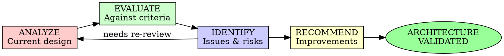

# Architecture Review

## Overview

Systematically review architecture and design decisions to ensure they meet requirements, follow best practices, and support long-term maintainability.

**Core principle:** Architecture is the foundation - get it right early.

## When to Use

**Always:**
- Before major implementation begins
- After Mob Construction sessions
- When changing architecture
- Before adding significant features

**Never skip:**
- "We'll refactor later"
- "It's obvious"
- "It's just a small change"

## The Review Cycle



## Review Dimensions

### 1. Requirement Alignment

Verify architecture meets requirements:

```markdown
## Requirement Alignment

### Functional Requirements
- [ ] Req 1: Supported by architecture? [Yes/No/Partial]
- [ ] Req 2: Supported by architecture? [Yes/No/Partial]

### Non-Functional Requirements
- [ ] Performance: Target met? [Yes/No]
- [ ] Scalability: Can scale to X users? [Yes/No]
- [ ] Security: Meets security requirements? [Yes/No]
- [ ] Reliability: Meets uptime SLA? [Yes/No]

### Constraints
- [ ] Budget constraints: Within limits? [Yes/No]
- [ ] Technology constraints: Compatible? [Yes/No]
- [ ] Integration constraints: Supported? [Yes/No]
```

### 2. Pattern Appropriateness

Evaluate chosen patterns:

```markdown
## Pattern Review

### Architecture Pattern: [Pattern Name]
**Chosen:** [Clean Architecture / Microservices / MVC / etc]

**Evaluation:**
- [ ] Fits problem domain? [Yes/No]
- [ ] Team familiarity? [High/Med/Low]
- [ ] Ecosystem support? [Good/Fair/Poor]
- [ ] Scalability characteristics? [Meets/Partial/No]

**Alternatives Considered:**
1. [Alt 1]: Pros/Cons
2. [Alt 2]: Pros/Cons

**Verdict:** [Keep / Modify / Replace]
```

### 3. Component Design

Review component boundaries:

```markdown
## Component Review

### Component: [Name]
**Responsibility:** [Single sentence]

**Evaluation:**
- [ ] Single Responsibility? [Yes/No]
- [ ] Clear interface? [Yes/No]
- [ ] Appropriate dependencies? [Yes/No]
- [ ] Testable? [Yes/No]

**Coupling Analysis:**
- Inbound dependencies: [List]
- Outbound dependencies: [List]
- Coupling strength: [Low/Med/High]

**Recommendation:** [Accept / Refactor / Split]
```

### 4. Data Flow

Analyze data movement:

```markdown
## Data Flow Review

### Flow: [Name]
**Path:** [Component A] → [Component B] → [Component C]

**Evaluation:**
- [ ] Flow makes logical sense? [Yes/No]
- [ ] No unnecessary hops? [Yes/No]
- [ ] Data transformations clear? [Yes/No]
- [ ] Error handling at each step? [Yes/No]

**Bottlenecks:**
- [Potential bottleneck 1]: [Mitigation]
- [Potential bottleneck 2]: [Mitigation]

**Recommendation:** [Accept / Optimize / Redesign]
```

### 5. Integration Points

Review external integrations:

```markdown
## Integration Review

### Integration: [Service/API Name]
**Type:** [API / Database / Message Queue / etc]

**Evaluation:**
- [ ] Failure handling? [Circuit breaker / Retry / Fallback]
- [ ] Timeout strategy? [Defined / Missing]
- [ ] Rate limiting? [Handled / Not handled]
- [ ] Backward compatibility? [Versioned / Not versioned]

**Reliability:**
- SLA alignment: [Meets / Partial / No]
- Dependency risk: [Low / Med / High]

**Recommendation:** [Accept / Strengthen / Abstract]
```

### 6. Scalability Assessment

Evaluate scalability characteristics:

```markdown
## Scalability Review

### Current Capacity
- Concurrent users: [Number]
- Requests/second: [Number]
- Data volume: [Size]

### Scaling Strategy
- Horizontal scaling: [Supported / Limited / Not supported]
- Vertical scaling: [Supported / Limited / Not supported]
- Database scaling: [Read replicas / Sharding / None]
- Caching strategy: [Multi-layer / Simple / None]

### Bottlenecks
1. [Bottleneck 1]: [Impact] - [Solution]
2. [Bottleneck 2]: [Impact] - [Solution]

**Scalability Verdict:** [Ready / Needs work / Redesign required]
```

### 7. Security Architecture

Review security design:

```markdown
## Security Architecture Review

### Authentication
- Method: [JWT / OAuth / Session / etc]
- Token lifecycle: [Defined / Not defined]
- Refresh strategy: [Implemented / Not implemented]

### Authorization
- Model: [RBAC / ABAC / ACL]
- Enforcement points: [API Gateway / Service level / Both]
- Privilege escalation prevention: [Yes / No]

### Data Protection
- Encryption at rest: [Yes / No]
- Encryption in transit: [TLS 1.3 / TLS 1.2 / None]
- Sensitive data handling: [Tokenization / Encryption / Plaintext]

### Attack Surface
- API exposure: [Public / Internal / Mixed]
- Input validation: [Comprehensive / Partial / Missing]
- Rate limiting: [Implemented / Not implemented]

**Security Verdict:** [Strong / Adequate / Weak]
```

## Architecture Review Report

```markdown
# Architecture Review Report

## Executive Summary
- **Review Date:** [Date]
- **System:** [Name]
- **Reviewer:** [Name/AI]
- **Overall Status:** APPROVED / CHANGES REQUIRED / REJECTED

## Review Scope
- Components reviewed: [List]
- Focus areas: [List]
- Out of scope: [List]

## Findings Summary
- Critical issues: [N]
- Major issues: [N]
- Minor issues: [N]
- Recommendations: [N]

## Detailed Findings

### Finding 1: [Category] - [Severity]
**Component:** [Name]
**Issue:** [Description]
**Impact:** [What could go wrong]
**Recommendation:** [How to fix]
**Effort:** [Estimation]

### Finding 2: ...

## Recommendations

### Immediate (Must Fix)
1. [Recommendation 1]
2. [Recommendation 2]

### Short-term (Should Fix)
1. [Recommendation 3]
2. [Recommendation 4]

### Long-term (Nice to Have)
1. [Recommendation 5]

## Action Items
- [ ] [Owner]: [Action] - Due: [Date]
- [ ] [Owner]: [Action] - Due: [Date]

## Appendix
- Diagrams
- References
- Decision records
```

## Architecture Anti-Patterns

| Anti-Pattern | Problem | Solution |
|--------------|---------|----------|
| Big Ball of Mud | No clear structure | Apply Clean Architecture |
| God Object | One component does everything | Split responsibilities |
| Leaky Abstraction | Implementation details exposed | Strengthen interfaces |
| Circular Dependencies | Components depend on each other | Refactor dependencies |
| Premature Optimization | Over-engineered for current needs | YAGNI - build what you need |
| Wrong Abstraction | Abstraction doesn't fit domain | Redesign with domain experts |
| Distributed Monolith | Microservices with tight coupling | Re-architect or merge |
| Database as IPC | Services talk via database | Use explicit message passing |

## Review Checklist

### Pre-Review
- [ ] Architecture diagrams available
- [ ] Requirements document reviewed
- [ ] Constraints understood
- [ ] Team available for questions

### During Review
- [ ] All components evaluated
- [ ] All integrations reviewed
- [ ] Scalability assessed
- [ ] Security reviewed
- [ ] Tradeoffs documented

### Post-Review
- [ ] Findings documented
- [ ] Recommendations prioritized
- [ ] Action items assigned
- [ ] Follow-up review scheduled (if needed)

## Best Practices

### Do's

✅ Review early and often
✅ Involve the whole team
✅ Document rationale for decisions
✅ Consider alternatives
✅ Validate against requirements
✅ Think about future evolution
✅ Review scalability characteristics

### Don'ts

❌ Skip architecture review
❌ Rush the review process
❌ Ignore scalability concerns
❌ Skip security considerations
❌ Accept "we'll fix it later"
❌ Review without context
❌ Make decisions without tradeoff analysis

## Integration with AI-DLC

### Inception Phase
- Review architecture proposals
- Validate against requirements
- Mob Architecture Review session

### Construction Phase
- Continuous architecture validation
- Component-level reviews
- Integration reviews

### Operations Phase
- Architecture evolution reviews
- Performance-based adjustments
- Refactoring architecture

## Final Rule

```
Design → Review → Validate → Implement

Skip architecture review? You build on unstable ground.
```

No exceptions without your human partner's permission.
