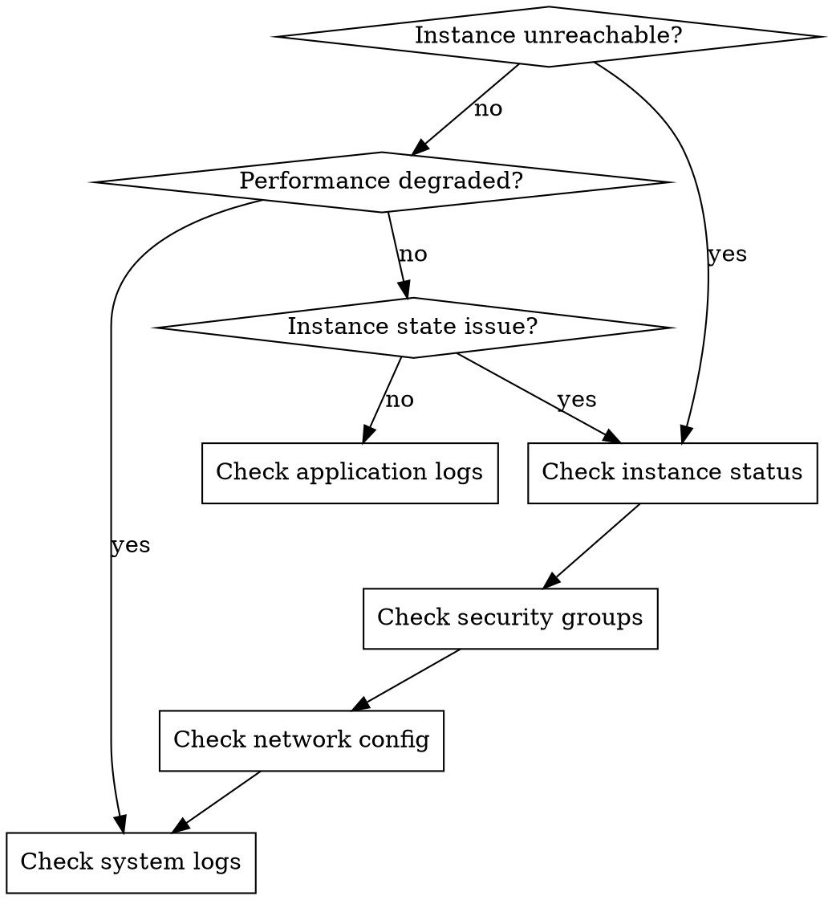

# AWS EC2 Debugging

## Overview

EC2 instances are the foundation of many AWS workloads. When things go wrong, you need systematic approaches to diagnose connectivity, performance, configuration, and state issues.

**Core principle:** Start with the most likely causes (security groups, network, instance state) and work toward application-level issues.

## When to Use



**Use when:**
- EC2 instance is unreachable (SSH/RDP fails)
- Instance is running but not responding
- Performance degradation on EC2 workloads
- Instance status checks failing
- Need to diagnose boot or configuration issues
- Investigating unexpected instance behavior

## Phase 1: Instance Status Assessment

### Check Instance State

```bash
# Get instance state and basic info
aws ec2 describe-instances --instance-ids <instance-id> \
  --query 'Reservations[].Instances[].[InstanceId,State.Name,InstanceType,PublicIpAddress,PrivateIpAddress]'

# Check instance status checks
aws ec2 describe-instance-status --instance-ids <instance-id>
```

**Key states to understand:**
- `pending` → `running`: Normal startup
- `running`: Instance is up (but may not be reachable)
- `stopping` → `stopped`: Instance was stopped
- `terminated`: Instance is gone (check if intentional)
- `shutting-down` → `terminated`: Instance is being terminated

### Check System Status vs Instance Status

```bash
# Detailed status checks
aws ec2 describe-instance-status \
  --instance-ids <instance-id> \
  --include-all-instances \
  --query 'InstanceStatuses[].[InstanceId,InstanceState.Name,SystemStatus.Status,InstanceStatus.Status]'
```

**Status check meanings:**
- **System Status:** AWS infrastructure (host, network, storage)
  - `ok`: AWS systems healthy
  - `impaired`: AWS-side issue (rare, contact support)
  - `initializing`: Checks in progress
  
- **Instance Status:** Guest OS and reachability
  - `ok`: Instance reachable and OS responding
  - `impaired`: OS-level issue (boot problem, network config, etc.)
  - `insufficient-data`: Not enough data yet

### Check for Scheduled Events

```bash
# Any maintenance or issues affecting the instance
aws ec2 describe-instance-status \
  --instance-ids <instance-id> \
  --query 'InstanceStatuses[].Events'

# All instances with scheduled events
aws ec2 describe-instance-status \
  --filters Name=event.code,Values=instance-reboot,system-reboot,system-maintenance \
  --query 'InstanceStatuses[].[InstanceId,Events]'
```

## Phase 2: Network Connectivity

### Verify Security Group Rules

```bash
# Get security groups attached to instance
aws ec2 describe-instances --instance-ids <instance-id> \
  --query 'Reservations[].Instances[].SecurityGroups'

# Check specific security group rules
aws ec2 describe-security-groups --group-ids <sg-id> \
  --query 'SecurityGroups[].IpPermissions[].[IpProtocol,FromPort,ToPort,IpRanges[].CidrIp]'
```

**Common security group issues:**
- SSH (port 22) not open from your IP
- RDP (port 3389) not open from your IP
- HTTP/HTTPS (80/443) not open to 0.0.0.0/0
- Wrong source IP range (corporate VPN changed?)
- Outbound rules too restrictive (rare but possible)

### Check Network ACLs and Route Tables

```bash
# Get VPC and subnet info
aws ec2 describe-instances --instance-ids <instance-id> \
  --query 'Reservations[].Instances[].[VpcId,SubnetId]'

# Check subnet's network ACL
aws ec2 describe-network-acls \
  --filters Name=vpc-id,Values=<vpc-id> \
  --query 'NetworkAcls[].Entries[].[RuleNumber,Protocol,RuleAction,CidrBlock,Egress,PortRange]'

# Check route table for subnet
aws ec2 describe-route-tables \
  --filters Name=association.subnet-id,Values=<subnet-id> \
  --query 'RouteTables[].Routes[].[DestinationCidrBlock,GatewayId,NatGatewayId,State]'
```

### Verify Elastic IP and Public IP

```bash
# Check if instance has Elastic IP
aws ec2 describe-addresses \
  --filters Name=instance-id,Values=<instance-id> \
  --query 'Addresses[].[PublicIp,AllocationId,AssociationId]'

# If no Elastic IP, check if public IP is assigned
aws ec2 describe-instances --instance-ids <instance-id> \
  --query 'Reservations[].Instances[].[PublicIpAddress,PublicDnsName]'
```

**Important:** If you stop and start an instance without an Elastic IP, the public IP changes!

### Test Connectivity

```bash
# Test SSH connectivity (Linux)
ssh -v -i <key-file> ec2-user@<public-ip>

# Test RDP connectivity (Windows)
nc -zv <public-ip> 3389

# Test HTTP/HTTPS
curl -I http://<public-ip>
curl -I https://<public-ip>

# Check if instance responds to ping (if ICMP allowed)
ping <public-ip>
```

## Phase 3: System-Level Debugging

### Access System Logs (Console Output)

```bash
# Get console output (boot logs)
aws ec2 get-console-output --instance-id <instance-id>

# Save to file for analysis
aws ec2 get-console-output --instance-id <instance-id> --output text > console.log
```

**What to look for:**
- Boot errors or kernel panics
- Disk mounting issues
- Network configuration problems
- SSH daemon startup issues
- Out of memory (OOM) killer messages

### Use Session Manager (Alternative to SSH)

If SSH isn't working, use AWS Systems Manager Session Manager:

```bash
# Check if SSM agent is running and instance is managed
aws ssm describe-instance-information \
  --filters Key=InstanceIds,Values=<instance-id>

# Start a session (requires SSM permissions)
aws ssm start-session --target <instance-id>
```

**Prerequisites:**
- SSM agent installed (pre-installed on Amazon Linux 2+, Ubuntu 16.04+)
- IAM role with `AmazonSSMManagedInstanceCore` policy
- Instance must be in a subnet with internet access or VPC endpoints

### Check CloudWatch Logs

```bash
# List log groups
aws logs describe-log-groups --query 'logGroups[].logGroupName'

# Get recent logs for a specific log group
aws logs filter-log-events \
  --log-group-name <log-group-name> \
  --start-time $(date -d '1 hour ago' +%s)000 \
  --query 'events[].[timestamp,message]' \
  --limit 50
```

## Phase 4: Performance Debugging

### Check CloudWatch Metrics

```bash
# Get CPU utilization for last hour
aws cloudwatch get-metric-statistics \
  --namespace AWS/EC2 \
  --metric-name CPUUtilization \
  --dimensions Name=InstanceId,Value=<instance-id> \
  --start-time $(date -u -d '1 hour ago' +%Y-%m-%dT%H:%M:%S) \
  --end-time $(date -u +%Y-%m-%dT%H:%M:%S) \
  --period 300 \
  --statistics Average \
  --query 'Datapoints[].[Timestamp,Average]' \
  --output table

# Get network metrics
aws cloudwatch get-metric-statistics \
  --namespace AWS/EC2 \
  --metric-name NetworkIn \
  --dimensions Name=InstanceId,Value=<instance-id> \
  --start-time $(date -u -d '1 hour ago' +%Y-%m-%dT%H:%M:%S) \
  --end-time $(date -u +%Y-%m-%dT%H:%M:%S) \
  --period 300 \
  --statistics Sum
```

**Key metrics to monitor:**
- **CPUUtilization:** High CPU = need larger instance or optimization
- **NetworkIn/NetworkOut:** Network saturation
- **DiskReadOps/DiskWriteOps:** EBS I/O throttling
- **StatusCheckFailed:** Instance or system issues

### Check EBS Volume Performance

```bash
# Get attached volumes
aws ec2 describe-instances --instance-ids <instance-id> \
  --query 'Reservations[].Instances[].BlockDeviceMappings[].[DeviceName,Ebs.VolumeId]'

# Check volume metrics
aws cloudwatch get-metric-statistics \
  --namespace AWS/EBS \
  --metric-name VolumeReadOps \
  --dimensions Name=VolumeId,Value=<volume-id> \
  --start-time $(date -u -d '1 hour ago' +%Y-%m-%dT%H:%M:%S) \
  --end-time $(date -u +%Y-%m-%dT%H:%M:%S) \
  --period 300 \
  --statistics Sum
```

**EBS I/O issues:**
- Check if burst balance is depleted (gp2 volumes)
- Consider provisioned IOPS (io1/io2) for consistent performance
- Monitor `VolumeQueueLength` metric

### Instance-Level Performance (via SSH/SSM)

```bash
# Check CPU and load average
top -bn1 | head -20
uptime

# Check memory usage
free -h
cat /proc/meminfo | grep -E 'MemTotal|MemFree|Buffers|Cached'

# Check disk usage and I/O
df -h
iostat -x 1 5

# Check network connections
ss -tuln
netstat -tuln

# Check running processes
ps aux --sort=-%cpu | head -20
ps aux --sort=-%mem | head -20
```

## Phase 5: IAM and Permission Issues

### Verify Instance Profile

```bash
# Check if instance has an IAM role
aws ec2 describe-instances --instance-ids <instance-id> \
  --query 'Reservations[].Instances[].IamInstanceProfile'

# Get the role name from the profile
aws iam get-instance-profile \
  --instance-profile-name <profile-name> \
  --query 'InstanceProfile.Roles[].RoleName'

# Check role policies
aws iam list-attached-role-policies --role-name <role-name>
aws iam list-role-policies --role-name <role-name>
```

**Common IAM issues:**
- Missing instance profile (no AWS API access from instance)
- Insufficient permissions for S3, SSM, CloudWatch, etc.
- Trust policy issues

### Test IAM Credentials from Instance

```bash
# From inside the instance, check if credentials work
aws sts get-caller-identity

# Check what permissions you have
aws iam simulate-principal-policy \
  --policy-source-arn <role-arn> \
  --action-names s3:GetObject ec2:DescribeInstances
```

## Phase 6: Common Issues and Solutions

### Instance Won't Start / Boot Issues

**Symptoms:** Instance stuck in `pending` or immediately goes to `terminated`

**Check:**
```bash
# Check if AMI exists and is available
aws ec2 describe-images --image-ids <ami-id> \
  --query 'Images[].[ImageId,State,PlatformDetails]'

# Check if instance type is supported in AZ
aws ec2 describe-instance-type-offerings \
  --location-type availability-zone \
  --filters Name=instance-type,Values=<instance-type> \
  --query 'InstanceTypeOfferings[].[InstanceType,Location]'

# Check VPC and subnet limits
aws ec2 describe-vpcs --vpc-ids <vpc-id> \
  --query 'Vpcs[].CidrBlockAssociationSet[].CidrBlock'
```

### SSH Connection Refused

**Checklist:**
1. ✅ Instance is `running`
2. ✅ Security group allows port 22 from your IP
3. ✅ Using correct key pair
4. ✅ Using correct username (ec2-user, ubuntu, admin, etc.)
5. ✅ Instance has public IP or you're on VPN
6. ✅ SSH daemon is running (check console output)

**Debug:**
```bash
# Verbose SSH for debugging
ssh -vvv -i <key-file> ec2-user@<ip>

# Check key file permissions (must be 600)
chmod 600 <key-file>

# Test with Session Manager as alternative
aws ssm start-session --target <instance-id>
```

### High CPU / Unresponsive Instance

**Immediate actions:**
```bash
# Stop the instance (data on EBS is preserved)
aws ec2 stop-instances --instance-ids <instance-id>

# Or reboot
aws ec2 reboot-instances --instance-ids <instance-id>

# If needed, force stop (last resort)
aws ec2 stop-instances --instance-ids <instance-id> --force
```

**Post-recovery analysis:**
- Check CloudWatch CPU metrics
- Review application logs
- Check for runaway processes
- Consider CPU-optimized instance types

### Disk Full Issues

```bash
# From inside the instance
df -h

# Find large files
du -h / | grep '^[0-9.]*G' | sort -hr | head -20

# Check for large log files
find /var/log -type f -size +100M

# Clean up package cache (Ubuntu/Debian)
apt-get clean

# Clean up package cache (Amazon Linux/RHEL)
yum clean all
```

## Cheat Sheet: Common Commands

| Issue | First Command | What to Look For |
|-------|--------------|------------------|
| Instance unreachable | `aws ec2 describe-instance-status` | State, status checks |
| SSH fails | `aws ec2 describe-security-groups` | Port 22 open? |
| Performance issue | CloudWatch CPU metrics | High utilization |
| Boot failure | `aws ec2 get-console-output` | Kernel errors |
| IAM issues | `aws sts get-caller-identity` | Role/permissions |
| Disk issues | `df -h` (from instance) | Full filesystem |
| Network issues | `ss -tuln` (from instance) | Listening ports |

## Debugging Checklist

Before escalating to AWS support:

- [ ] Instance is in `running` state
- [ ] System status checks are `ok`
- [ ] Security group allows traffic from your IP
- [ ] Network ACLs allow traffic
- [ ] Instance has public IP or you're on correct network
- [ ] Using correct SSH key and username
- [ ] Checked console output for boot errors
- [ ] Reviewed CloudWatch metrics for resource exhaustion
- [ ] Attempted Session Manager if SSH fails
- [ ] Verified IAM role and permissions
- [ ] Checked for scheduled maintenance events

## Key Principles

1. **Start with status checks** - They tell you if it's AWS infrastructure or your instance
2. **Security groups are #1 cause** - 80% of connectivity issues are security group rules
3. **Check console output** - Boot logs reveal startup issues
4. **Use Session Manager** - When SSH fails, SSM often still works
5. **Monitor CloudWatch** - Metrics show performance bottlenecks
6. **IAM roles > access keys** - More secure, easier to audit
7. **Elastic IPs for persistent endpoints** - Avoid IP changes on stop/start

## Integration with Other Skills

- **k8s-microservices-debug:** For EKS worker nodes and Kubernetes on EC2
- **incident-response:** For production outages involving EC2
- **performance-review:** For optimizing EC2 instance performance
- **root-cause-tracing:** For tracing application issues back to EC2 configuration

## Final Rule

```
EC2 Debugging:
- Check state first (is it running?)
- Check network second (security groups, NACLs, routes)
- Check system third (console output, logs)
- Check application last (performance, configuration)

Never assume - verify each layer systematically.
```

No exceptions without your human partner's permission.
