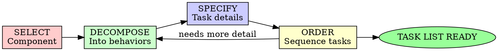

# Task Breakdown

## Overview

Transform implementation plans into discrete, actionable tasks. A task is the smallest unit of work that delivers value.

**Core principle:** If you can't test it, it's not a task.

**Violating the letter of the rules is violating the spirit of the rules.**

## When to Use

**Always:**
- Implementation plan is complete
- Before starting code execution
- When delegating to AI agents
- When tracking progress

**Never skip:**
- Jumping straight from plan to code
- Creating vague "implement feature" tasks
- Combining multiple behaviors in one task

## The Iron Law

```
NO CODE WITHOUT A TASK
```

Start coding from a plan without tasks? Stop. Break it down.

**No exceptions:**
- Don't code "as you go"
- Don't create placeholder tasks
- Don't make tasks too large to complete in one session

## The Breakdown Cycle



## Phase 1: SELECT - Pick a Component

### Component from Plan

Start with the first component in your implementation sequence:

```
Plan Component: Session Management
├── Task 1: Create session data model
├── Task 2: Implement session creation
├── Task 3: Add session validation
└── Task 4: Implement session expiration
```

### Component Completeness

Before breaking down, ensure:
- Component interface is defined
- Dependencies are identified
- Success criteria are clear

## Phase 2: DECOMPOSE - Into Behaviors

### Find the Behaviors

Ask: "What are all the things this component does?"

For a Session Management component:

1. Create new sessions
2. Validate existing sessions
3. Refresh expired sessions
4. Revoke sessions (logout)
5. Handle concurrent sessions

### Behavior Boundaries

Each behavior should:
- Do ONE thing
- Have clear input/output
- Be independently testable
- Have no side effects on other behaviors

<Good Behaviors>
- Create session with user ID
- Validate session token
- Check session expiration
- Revoke single session
</Good Behaviors>

<Bad Behaviors>
- Handle all session operations
- Do authentication and session management
- Manage sessions and users
</Bad Behaviors>

### Edge Cases Are Tasks

Every edge case is a separate task:

- Happy path: Session created successfully
- Edge case: Token expired
- Edge case: Invalid token format
- Edge case: Session revoked
- Edge case: Concurrent session limit reached

## Phase 3: SPECIFY - Task Details

### Task Structure

Every task must have:

```markdown
## Task: [Number] - [Name]

### Description
One sentence describing what this task accomplishes.

### Acceptance Criteria
- [ ] Criterion 1 (measurable)
- [ ] Criterion 2 (testable)
- [ ] Criterion 3 (specific)

### Technical Notes
- Implementation hints
- File locations
- Dependency requirements

### Files to Modify
- `src/services/session.ts`
- `src/types/session.ts`

### Estimated Complexity
Low / Medium / High

### Dependencies
- Task X must be complete
- Y must be available
```

### Acceptance Criteria Template

Use Given/When/Then format:

```markdown
### Acceptance Criteria
- [ ] **Given** valid user credentials
  **When** session is created
  **Then** return session token with expiry
  
- [ ] **Given** expired token
  **When** validation attempted
  **Then** return 401 Unauthorized
  
- [ ] **Given** invalid token format
  **When** validation attempted
  **Then** return 400 Bad Request
```

### Task Sizing

| Size | Time | Test |
|------|------|------|
| Small | < 30 min | Can explain in one sentence |
| Medium | 30-90 min | Has 2-3 acceptance criteria |
| Large | 90-180 min | Should probably be split |
| XL | > 180 min | Definitely split this |

**Rule:** If you can't complete it in one focused session, split it.

## Phase 4: ORDER - Sequence Tasks

### Dependency Order

Order by:
1. Data models first
2. Core functions next
3. Integration points after
4. Edge cases last

```
Session Management Tasks:
├── 1. Define Session interface (no deps)
├── 2. Create session storage schema (no deps)
├── 3. Implement createSession() (needs 1, 2)
├── 4. Implement validateSession() (needs 3)
├── 5. Implement refreshSession() (needs 4)
└── 6. Handle concurrent limits (needs 3)
```

### Parallel Tasks

Identify independent tasks:

```markdown
**Parallel Group A:**
- Task 1: Create session interface
- Task 2: Define storage schema

**Parallel Group B:** (after Group A)
- Task 3: Implement createSession
- Task 4: Implement validateSession
```

## Task List Structure

```markdown
# Task List: [Component Name]

## Summary
- Total Tasks: 12
- Estimated Time: 6 hours
- Parallel Groups: 3

## Tasks

### Task 1: [Name]
**Description:** ...
**Acceptance Criteria:**
- [ ] ...
- [ ] ...
**Complexity:** Low
**Dependencies:** None
**Files:** `src/...`

### Task 2: [Name]
...

## Execution Order

**Group 1 - Foundation:**
1. Task 1
2. Task 2

**Group 2 - Implementation:**
3. Task 3
4. Task 4

**Group 3 - Edge Cases:**
5. Task 5
6. Task 6

## Definition of Done
- [ ] All acceptance criteria pass
- [ ] Tests written and passing
- [ ] No lint/type errors
- [ ] Code reviewed (if required)
```

## Task Breakdown Examples

### Example: User Authentication

<Weak Breakdown>
```markdown
## Task: Implement authentication
- Create login
- Handle sessions
- Add logout
```
</Weak Breakdown>

<Strong Breakdown>
```markdown
## Task 1: Define User Types
**Description:** Create TypeScript interfaces for user data
**Acceptance Criteria:**
- [ ] User interface with id, email, password_hash fields
- [ ] UserCredentials interface for login
- [ ] UserSession interface with token and expiry
**Complexity:** Low
**Dependencies:** None
**Files:** `src/types/user.ts`

## Task 2: Implement Password Hashing
**Description:** Create utility for secure password hashing
**Acceptance Criteria:**
- [ ] hashPassword() function using bcrypt
- [ ] verifyPassword() function
- [ ] Minimum 10 salt rounds
**Complexity:** Low
**Dependencies:** None
**Files:** `src/utils/crypto.ts`

## Task 3: Create User Service
**Description:** Implement user lookup and validation
**Acceptance Criteria:**
- [ ] findUserByEmail() returns user or null
- [ ] validateCredentials() checks password
- [ ] Returns appropriate error for invalid credentials
**Complexity:** Medium
**Dependencies:** Task 1, Task 2
**Files:** `src/services/user.ts`

## Task 4: Implement Session Generation
**Description:** Create JWT session tokens
**Acceptance Criteria:**
- [ ] generateToken() creates JWT with user ID
- [ ] Token expires in 24 hours
- [ ] Includes issued-at timestamp
**Complexity:** Medium
**Dependencies:** Task 1
**Files:** `src/services/session.ts`

## Task 5: Create Login Endpoint
**Description:** Implement POST /api/login
**Acceptance Criteria:**
- [ ] Returns 200 with token on valid credentials
- [ ] Returns 401 on invalid credentials
- [ ] Returns 400 on missing fields
- [ ] Rate limited to 5 attempts per minute
**Complexity:** High
**Dependencies:** Task 3, Task 4
**Files:** `src/api/login.ts`

## Task 6: Implement Token Validation
**Description:** Middleware to validate session tokens
**Acceptance Criteria:**
- [ ] Returns 401 for missing token
- [ ] Returns 401 for expired token
- [ ] Returns 401 for invalid signature
- [ ] Attaches user to request on success
**Complexity:** Medium
**Dependencies:** Task 4
**Files:** `src/middleware/auth.ts`

## Task 7: Create Logout Endpoint
**Description:** Implement POST /api/logout
**Acceptance Criteria:**
- [ ] Invalidates current session token
- [ ] Returns 200 on success
- [ ] Returns 401 if not authenticated
**Complexity:** Low
**Dependencies:** Task 6
**Files:** `src/api/logout.ts`
```
</Strong Breakdown>

## Task Tracking

### During Implementation

Mark progress:
```markdown
## Task 3: Create User Service
**Status:** 🔄 In Progress
**Started:** 2024-01-15 10:00
**Notes:** Need to handle database connection
```

### Completion Criteria

A task is done when:
- [ ] All acceptance criteria verified
- [ ] Tests pass (TDD: written first, watched fail, watched pass)
- [ ] No errors or warnings
- [ ] Code committed
- [ ] Documentation updated (if needed)

## Breakdown Anti-Patterns

| Anti-Pattern | Why It Fails | Fix |
|--------------|--------------|-----|
| "Implement everything" | Too big, no focus | One behavior per task |
| Vague acceptance criteria | Can't verify completion | Measurable criteria |
| Missing edge cases | Bugs in production | Test failure paths |
| No dependencies listed | Blocked during work | Map prerequisites |
| "I'll figure it out" | Wastes time | Research as separate task |

## Integration with TDD

Every implementation task pairs with TDD:

```
Task: Implement validateSession()
├── Sub-task 1: Write failing tests
├── Sub-task 2: Implement to pass tests
└── Sub-task 3: Refactor while green
```

Use the `test-driven-development` skill for each implementation task.

## Final Rule

```
Plan → Tasks → (TDD Cycle) → Working Code

Skip task breakdown? You're coding without clear goals.
```

No exceptions without your human partner's permission.
