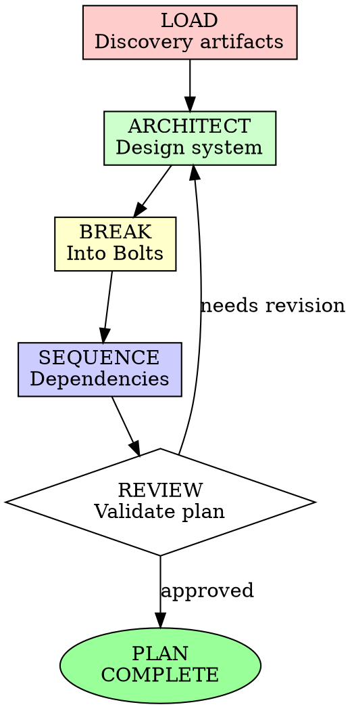

# Construction Planning Phase

## Overview

Transform discovery artifacts into actionable implementation plans. This skill ensures planning is thorough, architecturally sound, and broken into executable Bolts.

**Core principle:** Planning without Bolts is wishful thinking.

## When to Use

**Always for:**
- Features requiring substantial implementation
- Architectural changes
- Integration work
- Complex refactors

**Never skip when:**
- Understanding Phase artifacts exist
- Multiple components interact
- Risk of rework is high
- Team coordination required

## AI-DLC Phase: CONSTRUCTION - PLANNING

This skill is part of the **Planning sub-phase** of Construction in AI-DLC.

**Construction Planning Goal:** Transform understanding into executable implementation plan with clear Bolts.

**Flow:**
```
Discovery Artifacts → Architecture Design → Bolt Breakdown → Implementation Plan → Ready to Build
```

## The Iron Law

```
NO BUILDING WITHOUT A COMPLETED PLAN
```

Plan incomplete? Stop. Finish the plan first.

**No exceptions:**
- Don't start coding from discovery artifacts
- Don't skip architectural decisions
- Don't create vague "implement feature X" tasks

## The Planning Cycle



## Phase 1: LOAD - Consume Discovery Artifacts

### Required Inputs

Before planning begins, ensure these artifacts exist:

| Artifact | Purpose | Key Sections |
|----------|---------|--------------|
| `discovery-brief.md` | Understanding of problem and constraints | Goals, similar features, interactions, risks |
| `question-log.md` | Decisions made and assumptions | All blocking questions answered |
| `user-stories.md` | What to build | Acceptance criteria, value propositions |
| `test-scenarios.md` | Test requirements | Edge cases, failure modes |

### Discovery Brief Analysis Checklist

Read and extract:

- [ ] **Goals** - What success looks like
- [ ] **Constraints** - Technical and business limitations
- [ ] **Similar Features** - Patterns to follow or avoid
- [ ] **Interactions** - System boundaries and touchpoints
- [ ] **Assumptions** - What we're taking for granted
- [ ] **Risks** - What could go wrong
- [ ] **SLAs/Metrics** - Performance requirements

### Question Log Analysis

Review for:
- **Confirmed decisions** - Architect accordingly
- **Open questions** - Note as plan risks
- **Technical constraints** - Respect in design
- **Timeline pressures** - Scope Bolts appropriately

### User Story Mapping

Group stories by:
- **Theme** - Logical areas of functionality
- **Dependency** - What must come first
- **Risk** - Complex vs. simple work
- **Value** - High-value vs. foundational

## Phase 2: ARCHITECT - Design the System

### Architectural Decisions

Document in `architecture/decisions/`:

```markdown
# ADR-001: [Decision Title]

## Status
[Proposed / Accepted / Deprecated]

## Context
[What is the issue that we're seeing that is motivating this decision or change?]

## Decision
[What is the change that we're proposing or have agreed to implement?]

## Consequences
[What becomes easier or more difficult to do because of this change?]

## Alternatives Considered
- [Option A]: [Why rejected]
- [Option B]: [Why rejected]
```

### Key Architectural Areas

#### 1. System Architecture
- **Pattern**: MVC, Clean Architecture, Hexagonal, etc.
- **Components**: Services, modules, layers
- **Responsibilities**: What each component owns
- **Interfaces**: Contracts between components

#### 2. Data Architecture
Use `data-model-design` skill:
- Entities and relationships
- Schema design
- Migration strategy
- Query patterns

#### 3. API Design
Use `api-design` skill:
- Endpoint structure
- Request/response schemas
- Error handling
- Versioning strategy

#### 4. Integration Architecture
- External service interactions
- Event flows
- Queue design
- Retry and circuit breaker patterns

### Architecture Documentation Structure

Create `architecture/overview.md`:

```markdown
# Architecture Overview: [Feature]

## System Context
[High-level diagram or description of where this fits]

## Component Diagram
```
[Component A] → [Component B] → [Component C]
     ↓
[Data Store]
```

## Component Responsibilities

### Component A: [Name]
- **Purpose**: [What it does]
- **Interface**: [How others interact with it]
- **Dependencies**: [What it needs]
- **Data**: [What it owns]

### Component B: [Name]
...

## Data Flow
1. [Step 1]
2. [Step 2]
3. [Step 3]

## Error Handling Strategy
- [How errors propagate]
- [Recovery mechanisms]
- [Fallback behaviors]

## Scalability Considerations
- [Bottlenecks]
- [Scaling strategies]
- [Resource requirements]
```

## Phase 3: BREAK - Create Bolts

### What is a Bolt?

A **Bolt** is a unit of work that:
- Takes hours to days (not weeks)
- Has clear acceptance criteria
- Can be completed independently
- Produces working, tested code
- Can be reviewed as a unit

### Bolt Structure

Each Bolt gets its own file: `construction/bolts/bolt-NNN.md`

```markdown
# Bolt NNN: [Title]

## Metadata
- **Bolt ID**: NNN
- **Unit**: unit-xxx
- **Status**: [Planned / In Progress / Complete]
- **Estimated Duration**: [hours/days]
- **Priority**: [Critical / High / Medium / Low]
- **Assigned To**: [Role/Agent]

## Goal
[One-sentence outcome: What will be working when this Bolt is complete?]

## Context
[What the implementer needs to know]

## Acceptance Criteria
- [ ] [Specific, testable criterion 1]
- [ ] [Specific, testable criterion 2]
- [ ] [Specific, testable criterion 3]

## Implementation Notes
### Approach
[How to implement]

### Key Files
- `[path/to/file1]` - [Purpose]
- `[path/to/file2]` - [Purpose]

### Patterns to Follow
- [Reference to similar feature]
- [Architectural pattern]

### Testing Strategy
- [What to test]
- [Test data needed]
- [Edge cases to cover]

## Dependencies
### Requires
- [Bolt MMM] - [Why needed]
- [External dependency] - [Why needed]

### Required By
- [Bolt OOO] - [Why this is prerequisite]

## Risks
| Risk | Likelihood | Impact | Mitigation |
|------|------------|--------|------------|
| [Risk 1] | [Low/Med/High] | [Low/Med/High] | [Approach] |

## Definition of Done
- [ ] Code implemented
- [ ] Tests passing
- [ ] Documentation updated
- [ ] Code reviewed
- [ ] Committed to branch
- [ ] Context saved
```

### Bolt Sizing Guidelines

| Duration | Type | Examples |
|----------|------|----------|
| 2-4 hours | Spike | Research, proof of concept |
| 4-8 hours | Small | Single endpoint, simple UI component |
| 1-2 days | Medium | Feature slice, integration work |
| 2-3 days | Large | Complex feature, multiple components |

**Never:**
- Exceed 3 days without breaking down further
- Combine unrelated functionality
- Leave acceptance criteria vague

## Phase 4: SEQUENCE - Establish Dependencies

### Dependency Mapping

Create visual or tabular dependency map:

```markdown
## Bolt Dependencies

```
Bolt-001 (Foundation)
    ├── Bolt-002 (API Contract)
    │       ├── Bolt-004 (Implement Endpoint A)
    │       └── Bolt-005 (Implement Endpoint B)
    └── Bolt-003 (Data Model)
            └── Bolt-006 (Integration)
```

### Sequencing Principles

1. **Foundation First** - Infrastructure, models, contracts
2. **Risk Early** - Address unknowns in early Bolts
3. **Value Early** - Deliver working increments quickly
4. **Parallel When Possible** - Independent Bolts can proceed simultaneously
5. **Integration Points** - Plan integration testing Bolts

### Critical Path Identification

Identify the longest dependency chain:
- This determines minimum timeline
- Consider overlapping work where possible
- Flag critical path Bolts for priority

## Phase 5: PLAN - Create Master Plan

### Master Plan Structure

Create `construction/plan.md`:

```markdown
# Construction Plan: [Feature Name]

## Metadata
- **Unit ID**: unit-xxx
- **Planning Started**: [date]
- **Planning Completed**: [date]
- **Status**: [Draft / Review / Approved]
- **Planned Duration**: [total estimate]

## Summary
[2-3 sentence overview of the plan]

## Architecture
[Link to architecture/ folder]

## Bolt Summary
| Bolt | Title | Duration | Priority | Status | Owner |
|------|-------|----------|----------|--------|-------|
| 001 | [Title] | 1 day | Critical | Planned | Build Agent |
| 002 | [Title] | 2 days | High | Planned | Build Agent |

## Timeline

### Week 1
- Bolt 001: [Description]
- Bolt 002: [Description]

### Week 2
- Bolt 003: [Description]
- Bolt 004: [Description]

## Risk Assessment
| Risk | Likelihood | Impact | Mitigation | Owner |
|------|------------|--------|------------|-------|
| [Risk 1] | [Low/Med/High] | [Low/Med/High] | [Approach] | [Who] |

## Assumptions
- [Assumption 1]: [Implication if wrong]
- [Assumption 2]: [Implication if wrong]

## Open Questions
- [Question 1]: [Impact on plan]

## Success Criteria
- [ ] All user stories implemented
- [ ] All test scenarios passing
- [ ] Performance requirements met
- [ ] Security review passed
- [ ] Documentation complete

## Handoff to Build
**Ready to Build:** [YES / NO]

**Prerequisites:**
- [ ] Architecture approved
- [ ] Bolts defined with acceptance criteria
- [ ] Dependencies mapped
- [ ] Risks acknowledged
- [ ] Team aligned
```

## Phase 6: REVIEW - Validate the Plan

### Self-Review Checklist

Before calling plan complete:

- [ ] All discovery artifacts reviewed
- [ ] Architecture decisions documented
- [ ] Data models designed
- [ ] APIs specified
- [ ] Bolts are appropriately sized (hours-days)
- [ ] Each Bolt has clear acceptance criteria
- [ ] Dependencies mapped and logical
- [ ] Critical path identified
- [ ] Risks assessed with mitigations
- [ ] Timeline is realistic
- [ ] Success criteria defined

### Mob Review Session

Present plan to team:

1. **Walk through architecture** - Show diagrams, explain decisions
2. **Review Bolts** - Ensure understanding of each unit
3. **Validate sequencing** - Confirm dependencies make sense
4. **Discuss risks** - Get input on mitigation strategies
5. **Confirm timeline** - Ensure estimates are realistic

### Plan Revision

Based on feedback:
- Adjust Bolt scope
- Re-sequence dependencies
- Add missing Bolts
- Update risk mitigations
- Revise timeline

## Artifact Storage

### Recommended Structure

```
.ai-dlc/
  units/
    unit-xxx/
      discovery/              # From Understanding Phase
        discovery-brief.md
        question-log.md
        user-stories.md
        test-scenarios.md
      construction/
        plan.md               # Master plan
        architecture/
          overview.md         # High-level architecture
          decisions/          # ADRs
            adr-001.md
            adr-002.md
          data-model.md       # Schema design
          api-contract.md     # API specifications
        bolts/                # Individual work units
          bolt-001.md
          bolt-002.md
          bolt-003.md
        state.md              # Planning progress
```

## Integration with Other Skills

### With `understanding-discovery`

- **Input**: Discovery artifacts
- **Process**: Transform understanding into plan
- **Output**: Implementation plan

### With `data-model-design`

- Use for database/schema design
- Document in `architecture/data-model.md`

### With `api-design`

- Use for API contract design
- Document in `architecture/api-contract.md`

### With `mob-collaboration`

- Use for plan review sessions
- Document decisions in `architecture/decisions/`

### With `context-persistence`

- Store all planning artifacts
- Maintain state across planning sessions

## Anti-Patterns

| Anti-Pattern | Problem | Solution |
|--------------|---------|----------|
| "We'll figure it out as we build" | Rework, missed requirements | Complete plan first |
| Bolts too large | Loss of focus, hard to review | Break into smaller Bolts |
| Missing acceptance criteria | Unclear when done | Every Bolt needs testable criteria |
| Ignoring discovery artifacts | Repeated work, missed constraints | Always start with discovery review |
| Architecture decisions undocumented | Team confusion, inconsistency | ADRs for all significant decisions |
| No dependency mapping | Blocked work, idle time | Map dependencies explicitly |
| Unrealistic timeline | Stress, cut corners | Use evidence-based estimation |

## Tool Usage

### Required Tools
- **Read** - Review discovery artifacts
- **Write** - Create plan documents
- **Edit** - Update artifacts
- **Skill** - Load required skills

### When to Use Skills
- `/skill data-model-design` - For database design
- `/skill api-design` - For API contracts
- `/skill mob-collaboration` - For plan review
- `/skill architecture-review` - For validating design

## Exit Criteria

Do not proceed to Build phase until:

- [ ] All discovery artifacts reviewed
- [ ] Architecture designed and documented
- [ ] Data models specified
- [ ] API contracts defined
- [ ] Bolts created (appropriately sized)
- [ ] Dependencies mapped
- [ ] Each Bolt has clear acceptance criteria
- [ ] Risks assessed
- [ ] Timeline established
- [ ] Plan reviewed and approved (via mob session)
- [ ] Artifacts saved to `construction/` folder

## Handoff to Build Phase

When planning is complete:

1. Ensure all artifacts are current
2. Summarize plan for Build agent:
   - Start with Bolt 001
   - Critical path highlighted
   - Key architectural decisions noted
3. Reference specific Bolt files for detailed instructions
4. Note any caveats or risks

**Example handoff:**
```
Construction Plan complete for Unit 012: Notification Overhaul

**Architecture:**
- Queue-based notification system (SQS)
- Multi-channel support (email, push, SMS)
- Hierarchical preference model
- See: construction/architecture/

**Bolts:** 8 total, ~10 days
- Bolt 001: Queue infrastructure (1 day) ← START HERE
- Bolt 002: Email channel refactor (2 days)
- Bolt 003: Push notification channel (2 days)
- ...

**Critical Path:** 001 → 002 → 005 → 007
**Key Decisions:**
- Using SQS over SNS for retry control (ADR-002)
- Preference inheritance: user → org → default

**Ready to Build:** YES
```

## Final Rules

1. **Always consume discovery artifacts** - Never plan from scratch
2. **Architecture before Bolts** - Design the system before breaking it down
3. **Bolts are executable** - Clear acceptance criteria, appropriate size
4. **Dependencies explicit** - Map what must come before what
5. **Review before building** - Mob validation of plan
6. **Document decisions** - ADRs for significant choices

```
Discovery → Architecture → Bolts → Sequencing → Review → Build
```

No exceptions without your human partner's permission.
