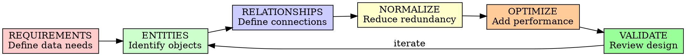

# Data Model Design

## Overview

Design data models that are normalized, performant, scalable, and aligned with business requirements. Good data models are the foundation of reliable systems.

**Core principle:** Data outlives code - design for the long term.

## When to Use

**Always:**
- Creating new database schemas
- Adding new entities
- Modifying existing models
- Designing for scale
- Handling complex relationships

**Never skip:**
- "We'll use NoSQL and figure it out later"
- "Just add a column"
- "Denormalize everything for speed"

## The Data Model Cycle



## Database Selection

### Relational (SQL)
**Best for:** ACID transactions, complex relationships, structured data
**Examples:** PostgreSQL, MySQL, SQL Server

### Document (NoSQL)
**Best for:** Flexible schemas, hierarchical data, rapid development
**Examples:** MongoDB, Couchbase

### Key-Value
**Best for:** Caching, sessions, simple lookups
**Examples:** Redis, DynamoDB

### Column-Family
**Best for:** Time-series, analytics, write-heavy
**Examples:** Cassandra, HBase

### Graph
**Best for:** Deep relationships, social networks, recommendations
**Examples:** Neo4j, Amazon Neptune

### Search
**Best for:** Full-text search, faceted search
**Examples:** Elasticsearch, OpenSearch

## Entity Design

### Naming Conventions

**Tables/Collections:**
```
✅ users (plural, lowercase)
✅ order_items (snake_case for multi-word)
✅ organizations

❌ User (singular, uppercase)
❌ orderItems (camelCase)
❌ tbl_users (Hungarian notation)
```

**Columns/Fields:**
```
✅ created_at (timestamp)
✅ user_id (foreign key)
✅ email_address

❌ createdAt (camelCase in SQL)
❌ userID (inconsistent case)
❌ usr_eml (abbreviations)
```

### Standard Fields

Every entity should have:
```sql
CREATE TABLE entities (
    id UUID PRIMARY KEY DEFAULT gen_random_uuid(),
    created_at TIMESTAMP WITH TIME ZONE DEFAULT NOW(),
    updated_at TIMESTAMP WITH TIME ZONE DEFAULT NOW(),
    deleted_at TIMESTAMP WITH TIME ZONE, -- Soft delete
    version INTEGER DEFAULT 1, -- Optimistic locking
    
    -- Entity-specific fields
    name VARCHAR(255) NOT NULL,
    -- ...
);
```

### Data Types

**PostgreSQL Best Practices:**
```sql
-- IDs: Use UUID for distributed systems
id UUID PRIMARY KEY DEFAULT gen_random_uuid()

-- Or SERIAL/BIGSERIAL for single-node
id BIGSERIAL PRIMARY KEY

-- Timestamps: Always with timezone
created_at TIMESTAMPTZ DEFAULT NOW()

-- Text: VARCHAR with limit or TEXT
name VARCHAR(255) NOT NULL
description TEXT

-- Enums: Use native enum or check constraints
status VARCHAR(50) CHECK (status IN ('active', 'inactive'))

-- Money: Never use float, use DECIMAL
price DECIMAL(10, 2) NOT NULL

-- JSON: For flexible data
metadata JSONB

-- Arrays: When appropriate
tags TEXT[]
```

## Relationship Design

### One-to-Many

```sql
-- Users have many Orders
CREATE TABLE users (
    id UUID PRIMARY KEY,
    email VARCHAR(255) UNIQUE NOT NULL
);

CREATE TABLE orders (
    id UUID PRIMARY KEY,
    user_id UUID NOT NULL REFERENCES users(id) ON DELETE CASCADE,
    total DECIMAL(10, 2) NOT NULL
);

-- Index for foreign key
CREATE INDEX idx_orders_user_id ON orders(user_id);
```

### Many-to-Many

```sql
-- Users and Roles (many-to-many)
CREATE TABLE users (
    id UUID PRIMARY KEY,
    email VARCHAR(255) UNIQUE NOT NULL
);

CREATE TABLE roles (
    id UUID PRIMARY KEY,
    name VARCHAR(100) UNIQUE NOT NULL
);

-- Junction table
CREATE TABLE user_roles (
    user_id UUID NOT NULL REFERENCES users(id) ON DELETE CASCADE,
    role_id UUID NOT NULL REFERENCES roles(id) ON DELETE CASCADE,
    assigned_at TIMESTAMPTZ DEFAULT NOW(),
    assigned_by UUID REFERENCES users(id),
    PRIMARY KEY (user_id, role_id)
);

-- Indexes
CREATE INDEX idx_user_roles_user ON user_roles(user_id);
CREATE INDEX idx_user_roles_role ON user_roles(role_id);
```

### One-to-One

```sql
-- User and UserProfile (one-to-one)
CREATE TABLE users (
    id UUID PRIMARY KEY,
    email VARCHAR(255) UNIQUE NOT NULL
);

CREATE TABLE user_profiles (
    user_id UUID PRIMARY KEY REFERENCES users(id) ON DELETE CASCADE,
    bio TEXT,
    avatar_url VARCHAR(500)
);
```

### Self-Referencing

```sql
-- Organization hierarchy
CREATE TABLE organizations (
    id UUID PRIMARY KEY,
    name VARCHAR(255) NOT NULL,
    parent_id UUID REFERENCES organizations(id),
    level INTEGER DEFAULT 0,
    path LTREE -- For fast tree traversal
);

CREATE INDEX idx_org_parent ON organizations(parent_id);
CREATE INDEX idx_org_path ON organizations USING GIST(path);
```

## Normalization

### First Normal Form (1NF)
- Atomic values (no repeating groups)
- No arrays in columns (unless needed)

```sql
❌ Bad: Multiple emails in one column
email VARCHAR(255) -- Contains "a@b.com,c@d.com"

✅ Good: Separate table
CREATE TABLE user_emails (
    user_id UUID REFERENCES users(id),
    email VARCHAR(255),
    is_primary BOOLEAN DEFAULT FALSE,
    PRIMARY KEY (user_id, email)
);
```

### Second Normal Form (2NF)
- All non-key attributes depend on entire primary key
- Only relevant for composite keys

```sql
❌ Bad: order_items has product_name (depends only on product_id, not order_id+product_id)

✅ Good: Reference products table
product_id UUID REFERENCES products(id)
```

### Third Normal Form (3NF)
- No transitive dependencies

```sql
❌ Bad: users has city_name (transitively depends on city_id → city table)

✅ Good: Normalize
users.city_id → cities.id → cities.name
```

### When to Denormalize

**Read-heavy workloads:**
- Add computed fields (e.g., order.total)
- Add counters (e.g., post.comment_count)
- Use materialized views

**Document databases:**
- Embed one-to-few relationships
- Keep related data together

## Indexing Strategy

### Primary Keys
```sql
-- Automatic index
PRIMARY KEY (id)
```

### Foreign Keys
```sql
-- Always index foreign keys
CREATE INDEX idx_orders_user_id ON orders(user_id);
```

### Search Fields
```sql
-- For lookup queries
CREATE INDEX idx_users_email ON users(email);

-- For partial matches (PostgreSQL)
CREATE INDEX idx_users_email_pattern ON users(email varchar_pattern_ops);

-- For full-text search
CREATE INDEX idx_posts_search ON posts USING gin(to_tsvector('english', content));
```

### Composite Indexes
```sql
-- For multi-column queries
CREATE INDEX idx_orders_status_date ON orders(status, created_at);

-- Column order matters: most selective first
```

### Partial Indexes
```sql
-- Only index active records
CREATE INDEX idx_active_users ON users(email) WHERE deleted_at IS NULL;

-- Index high-priority orders
CREATE INDEX idx_priority_orders ON orders(id) WHERE priority = 'high';
```

### Covering Indexes (INCLUDE)
```sql
-- Include additional columns to avoid table lookup
CREATE INDEX idx_orders_user_status ON orders(user_id, status) INCLUDE (total, created_at);
```

## Soft Deletes

```sql
-- Add deleted_at to all tables
ALTER TABLE users ADD COLUMN deleted_at TIMESTAMPTZ;

-- Views exclude deleted records
CREATE VIEW active_users AS
SELECT * FROM users WHERE deleted_at IS NULL;

-- Queries filter deleted
SELECT * FROM users WHERE deleted_at IS NULL AND email = 'test@example.com';

-- Restore
UPDATE users SET deleted_at = NULL WHERE id = 'uuid';

-- Permanent delete (rare)
DELETE FROM users WHERE deleted_at IS NOT NULL AND deleted_at < NOW() - INTERVAL '30 days';
```

## Data Integrity

### Constraints

```sql
-- NOT NULL
email VARCHAR(255) NOT NULL

-- UNIQUE
email VARCHAR(255) UNIQUE

-- CHECK
age INTEGER CHECK (age >= 0 AND age <= 150)

-- FOREIGN KEY
user_id UUID REFERENCES users(id) ON DELETE CASCADE

-- EXCLUDE (PostgreSQL)
-- Prevent overlapping time ranges
EXCLUDE USING gist (room_id WITH =, duration WITH &&)
```

### Transactions

```sql
BEGIN;

-- Insert user
INSERT INTO users (email) VALUES ('test@example.com') RETURNING id;

-- Insert profile
INSERT INTO user_profiles (user_id, bio) VALUES (last_id, 'Hello');

-- If any fails, both rollback
COMMIT;
```

## Schema Versioning

### Migration Strategy

```sql
-- 001_create_users.sql
CREATE TABLE users (
    id UUID PRIMARY KEY DEFAULT gen_random_uuid(),
    email VARCHAR(255) UNIQUE NOT NULL,
    created_at TIMESTAMPTZ DEFAULT NOW()
);

-- 002_add_user_profiles.sql
CREATE TABLE user_profiles (
    user_id UUID PRIMARY KEY REFERENCES users(id) ON DELETE CASCADE,
    bio TEXT
);

-- 003_add_user_status.sql
ALTER TABLE users ADD COLUMN status VARCHAR(50) DEFAULT 'active';
CREATE INDEX idx_users_status ON users(status);
```

### Backward Compatibility

- Add columns as NULLABLE first
- Backfill data
- Then add NOT NULL constraint
- Remove columns in separate deployment

## Scaling Strategies

### Read Replicas
- Route read queries to replicas
- Writes go to primary
- Eventual consistency acceptable

### Sharding
```sql
-- Shard by user_id hash
shard = hash(user_id) % num_shards
```

### Partitioning (PostgreSQL)
```sql
-- Partition by time range
CREATE TABLE events (
    id UUID,
    event_time TIMESTAMPTZ,
    data JSONB
) PARTITION BY RANGE (event_time);

CREATE TABLE events_2025_01 PARTITION OF events
    FOR VALUES FROM ('2025-01-01') TO ('2025-02-01');
```

### Archiving
```sql
-- Move old data to archive table
INSERT INTO events_archive SELECT * FROM events 
WHERE event_time < NOW() - INTERVAL '1 year';

DELETE FROM events WHERE event_time < NOW() - INTERVAL '1 year';
```

## Data Model Review Checklist

### Structure
- [ ] Entities properly identified
- [ ] Relationships correctly modeled
- [ ] Normalization appropriate (3NF unless reason to denormalize)
- [ ] Foreign keys properly defined
- [ ] Primary keys chosen appropriately

### Performance
- [ ] Indexes on search fields
- [ ] Foreign keys indexed
- [ ] Composite indexes for multi-column queries
- [ ] Query patterns considered
- [ ] Partitioning strategy (if needed)

### Integrity
- [ ] NOT NULL on required fields
- [ ] UNIQUE constraints where needed
- [ ] CHECK constraints for business rules
- [ ] Foreign key CASCADE rules appropriate
- [ ] Soft deletes implemented

### Standards
- [ ] Naming conventions followed
- [ ] Standard fields present (id, created_at, updated_at)
- [ ] Data types appropriate
- [ ] Consistent patterns across tables

### Evolution
- [ ] Schema versioning strategy
- [ ] Migration scripts
- [ ] Backward compatibility plan
- [ ] Rollback plan

## Common Patterns

### Audit Trail
```sql
CREATE TABLE audit_log (
    id UUID PRIMARY KEY,
    table_name VARCHAR(100) NOT NULL,
    record_id UUID NOT NULL,
    action VARCHAR(20) NOT NULL, -- INSERT, UPDATE, DELETE
    old_data JSONB,
    new_data JSONB,
    changed_by UUID REFERENCES users(id),
    changed_at TIMESTAMPTZ DEFAULT NOW()
);
```

### Multi-tenancy
```sql
-- Shared database, separate schema per tenant
CREATE SCHEMA tenant_1;
CREATE TABLE tenant_1.users (...);

-- Or shared schema with tenant_id
CREATE TABLE users (
    id UUID PRIMARY KEY,
    tenant_id UUID NOT NULL,
    email VARCHAR(255) NOT NULL,
    UNIQUE (tenant_id, email)
);
```

### Time-Series
```sql
CREATE TABLE metrics (
    time TIMESTAMPTZ NOT NULL,
    metric_name VARCHAR(100) NOT NULL,
    value FLOAT NOT NULL,
    tags JSONB
) PARTITION BY RANGE (time);

-- Hypertable (TimescaleDB) or manual partitions
```

## Best Practices

### Do's

✅ Design for query patterns, not just storage
✅ Use appropriate data types
✅ Normalize first, denormalize intentionally
✅ Index foreign keys
✅ Version your schema
✅ Plan for soft deletes
✅ Consider data growth
✅ Document relationships
✅ Use transactions for multi-step operations

### Don'ts

❌ Use float for money
❌ Store passwords (use hashes)
❌ Skip indexing on search fields
❌ Denormalize prematurely
❌ Use TEXT when VARCHAR suffices
❌ Forget about timezone handling
❌ Store images in database (use URLs)
❌ Have too many columns (> 50 reconsider)

## Integration with AI-DLC

### Inception Phase
- Data requirements gathering
- Entity identification
- Relationship mapping

### Construction Phase
- Schema implementation
- Migration creation
- Index optimization

### Operations Phase
- Schema evolution
- Performance monitoring
- Data archiving

## Final Rule

```
Good data model:
- Normalized (reduces redundancy)
- Indexed (fast queries)
- Constrained (data integrity)
- Versioned (safe evolution)
- Scalable (handles growth)

Skip good data modeling? You'll pay in performance and integrity.
```

No exceptions without your human partner's permission.
