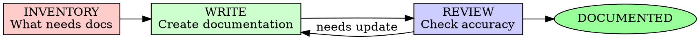

# Documentation Generation

## Overview

Transform working code into understandable documentation. Documentation is the bridge between code and its users.

**Core principle:** If it needs explaining, document it.

**Violating the letter of the rules is violating the spirit of the rules.**

## When to Use

**Always:**
- Feature implementation complete
- Before marking work done
- Public APIs need documentation
- Complex logic needs explanation
- Onboarding new developers

**Never skip:**
- "The code is self-documenting"
- "I'll add docs later"
- "It's obvious how it works"

## The Iron Law

```
NO FEATURE COMPLETE WITHOUT DOCUMENTATION
```

Ready to ship? Stop. Document first.

**No exceptions:**
- Don't defer documentation
- Don't assume users will figure it out
- Don't skip for internal tools

## The Documentation Cycle



## Phase 1: INVENTORY - What Needs Documentation

### Documentation Types

Identify what documentation is needed:

```markdown
## Documentation Inventory

### User-Facing
- [ ] README.md - Project overview
- [ ] API documentation - Endpoints & usage
- [ ] Usage examples - Getting started guide
- [ ] Configuration guide - Setup instructions
- [ ] Troubleshooting - Common issues

### Developer-Facing
- [ ] Architecture docs - Design decisions
- [ ] Contributing guide - How to contribute
- [ ] Code comments - Inline documentation
- [ ] Type documentation - Interfaces/types
- [ ] Testing guide - How to test

### Operations
- [ ] Deployment guide - How to deploy
- [ ] Monitoring - Metrics & alerts
- [ ] Runbook - Incident response
```

### Documentation Decisions

For each type, decide:
- **Priority**: Critical, High, Medium, Low
- **Audience**: Who will read this?
- **Location**: Where should it live?
- **Format**: Markdown, inline comments, generated docs?

## Phase 2: WRITE - Create Documentation

### README.md Template

```markdown
# Project Name

One-paragraph description of what this project does.

## Features

- Feature 1: Description
- Feature 2: Description
- Feature 3: Description

## Quick Start

### Installation
\`\`\`bash
npm install package-name
# or
yarn add package-name
\`\`\`

### Basic Usage
\`\`\`typescript
import { feature } from 'package-name';

const result = feature({ option: 'value' });
console.log(result);
\`\`\`

## Documentation

- [API Reference](./docs/API.md)
- [Configuration](./docs/CONFIG.md)
- [Examples](./examples/)

## Requirements

- Node.js >= 18
- TypeScript >= 5.0

## Contributing

See [CONTRIBUTING.md](./CONTRIBUTING.md)

## License

MIT
```

### API Documentation

Document every public interface:

```typescript
/**
 * Authenticates a user with their credentials.
 * 
 * @param credentials - The user's login credentials
 * @param credentials.email - User's email address
 * @param credentials.password - User's password (plaintext, will be hashed)
 * 
 * @returns A promise that resolves to the authentication result
 * @returns {Promise<AuthResult>} Object containing user info and session token
 * 
 * @throws {ValidationError} When email or password is missing
 * @throws {AuthenticationError} When credentials are invalid
 * @throws {RateLimitError} When too many attempts made
 * 
 * @example
 * ```typescript
 * try {
 *   const result = await authenticate({
 *     email: 'user@example.com',
 *     password: 'secret123'
 *   });
 *   console.log('Token:', result.token);
 * } catch (error) {
 *   if (error instanceof AuthenticationError) {
 *     console.log('Invalid credentials');
 *   }
 * }
 * ```
 * 
 * @since 1.0.0
 */
async function authenticate(credentials: Credentials): Promise<AuthResult> {
  // Implementation
}
```

### Code Comments

Comment style guide:

<Good Comment>
```typescript
// We retry 3 times because the upstream service occasionally
// returns 503 during deployments. This gives time for the
// rolling update to complete without failing our requests.
const MAX_RETRIES = 3;
```
</Good Comment>

<Bad Comment>
```typescript
// Set retries to 3
const MAX_RETRIES = 3;
```
</Bad Comment>

**Rule:** Explain WHY, not WHAT. The code shows what.

### Usage Examples

Create practical examples:

```markdown
## Examples

### Basic Authentication

\`\`\`typescript
import { authenticate } from './auth';

// Simple login
const session = await authenticate({
  email: 'user@example.com',
  password: 'password123'
});

// Use the session token for subsequent requests
apiClient.setToken(session.token);
\`\`\`

### Handling Errors

\`\`\`typescript
import { authenticate, AuthenticationError, RateLimitError } from './auth';

try {
  const session = await authenticate(credentials);
} catch (error) {
  if (error instanceof AuthenticationError) {
    console.error('Invalid email or password');
  } else if (error instanceof RateLimitError) {
    console.error('Too many attempts. Please try again later.');
  } else {
    console.error('Unexpected error:', error);
  }
}
\`\`\`

### Session Refresh

\`\`\`typescript
import { refreshSession, validateSession } from './auth';

// Check if session needs refresh
const status = await validateSession(token);

if (status.expiresIn < 300) {  // Less than 5 minutes
  const newSession = await refreshSession(token);
  saveToken(newSession.token);
}
\`\`\`
```

## Phase 3: REVIEW - Check Accuracy

### Documentation Review Checklist

```markdown
## Documentation Review

### Completeness
- [ ] All public APIs documented
- [ ] All configuration options listed
- [ ] All error scenarios covered
- [ ] Examples cover common use cases

### Accuracy
- [ ] Code examples compile/run
- [ ] API signatures match implementation
- [ ] File paths are correct
- [ ] Links work

### Clarity
- [ ] Language is simple and direct
- [ ] Technical terms defined
- [ ] No jargon without explanation
- [ ] Structure is logical

### Consistency
- [ ] Terminology consistent
- [ ] Formatting consistent
- [ ] Tone consistent
- [ ] Cross-references accurate
```

### Testing Documentation

Verify examples work:

```bash
# Extract and test code examples
npm run test:examples

# Check for broken links
npm run test:links

# Validate markdown
npm run lint:docs
```

## Documentation Types

### 1. README.md

Project front door:
- What is this?
- Why should I care?
- How do I start?
- Where do I get help?

### 2. API Documentation

Reference for developers:
- All public functions/classes
- Parameters and return values
- Error conditions
- Code examples

### 3. Architecture Documentation

For contributors:
- System overview
- Design decisions
- Data flow
- Component relationships

### 4. Usage Guides

For users:
- Step-by-step instructions
- Best practices
- Common patterns
- Troubleshooting

### 5. Contributing Guide

For contributors:
- Development setup
- Code standards
- Testing requirements
- PR process

## Documentation Best Practices

### The 5 Ws

Every document should answer:
- **WHO** is this for?
- **WHAT** does it cover?
- **WHEN** should I use this?
- **WHERE** do I find related info?
- **WHY** does this work this way?

### Documentation Pyramid

```
            Quick Start
                 |
            Tutorials
            /    |    \
      Guides  API Ref  Examples
          /      |       \
    Architecture  |    Troubleshooting
            \     |     /
            Full Reference
                 |
              README
```

### Living Documentation

Keep docs current:
- Update with code changes
- Review in PR process
- Automated doc generation
- Regular doc audits

## Documentation Anti-Patterns

| Anti-Pattern | Why It Fails | Fix |
|--------------|--------------|-----|
| "Self-documenting code" | Only for trivial code | Add context comments |
| Outdated docs | Users lose trust | Update with code |
| Copy-pasted examples | Break when code changes | Extract from tests |
| Walls of text | No one reads them | Use formatting |
| No examples | Abstract and confusing | Show, don't tell |

## Final Rule

```
Code → Tests → Documentation → Ship

Skip documentation? Users will struggle.
```

No exceptions without your human partner's permission.
