# Incident Response

## Overview

Systematically respond to production incidents to minimize impact, restore service quickly, and prevent recurrence. Incident response is a critical operational capability.

**Core principle:** The goal is to restore service first, investigate later.

## When to Use

**Always:**
- Service outages
- Performance degradation
- Security breaches
- Data corruption
- Infrastructure failures
- Customer-impacting issues

**Severity Levels:**
- **SEV-1:** Complete outage, revenue-impacting
- **SEV-2:** Major functionality impaired
- **SEV-3:** Minor functionality impaired
- **SEV-4:** Cosmetic issues, low impact

## The Incident Response Cycle

```dot
digraph incident {
    rankdir=LR;
    detect [label="DETECT\nAlert/page", shape=box, style=filled, fillcolor="#ffcccc"];
    respond [label="RESPOND\nAcknowledge", shape=box, style=filled, fillcolor="#ccffcc"];
    assess [label="ASSESS\nTriage impact", shape=box, style=filled, fillcolor="#ccccff"];
    mitigate [label="MITIGATE\nReduce impact", shape=box, style=filled, fillcolor="#ffffcc"];
    resolve [label="RESOLVE\nFix root cause", shape=box, style=filled, fillcolor="#99ff99"];
    postmortem [label="POSTMORTEM\nLearn & improve", shape=box, style=filled, fillcolor="#ffcc99"];

    detect -> respond -> assess -> mitigate -> resolve -> postmortem;
    assess -> mitigate [label="sev-1: rollback"];
    mitigate -> detect [label="ongoing monitoring"];
}
```



## Incident Response Roles

### Incident Commander (IC)
- Coordinates response
- Makes go/no-go decisions
- Communicates status
- Owns the incident

### Technical Lead (TL)
- Leads technical investigation
- Implements fixes
- Advises on technical decisions

### Communications Lead (CL)
- Customer communications
- Internal status updates
- Post-incident summary

### Scribe
- Documents timeline
- Records decisions
- Captures key findings

## Incident Response Process

### Phase 1: Detection & Response (0-5 min)

**Detection Sources:**
- Automated monitoring alerts
- Customer reports
- Internal reports
- Health checks failing

**Immediate Actions:**
```markdown
## T+0: Alert Received

1. **Acknowledge alert**
   - [ ] Page acknowledged
   - [ ] Incident war room created
   - [ ] Team assembled

2. **Initial Assessment**
   - [ ] Service impacted: [Name]
   - [ ] Severity: [SEV-1/2/3/4]
   - [ ] Customer impact: [Description]
   - [ ] Error rate: [X]%

3. **Communication**
   - [ ] Status page updated (if SEV-1/2)
   - [ ] Stakeholders notified
   - [ ] Slack channel: #incident-[id]
```

### Phase 2: Assessment & Triage (5-15 min)

**Key Questions:**
1. What is failing? (service, region, specific endpoints)
2. Who is affected? (all customers, subset, internal)
3. When did it start? (timeline)
4. What changed? (deployments, config, infrastructure)

```markdown
## T+5: Initial Triage

**Impact Assessment:**
- Services affected: [List]
- Error rate: [X]% (normal: [Y]%)
- Response time: [X]ms (normal: [Y]ms)
- Regions affected: [List]
- Customer impact: [Description]

**Recent Changes:**
- Last deployment: [Time] - [Commit/PR]
- Last config change: [Time] - [What changed]
- Last infrastructure change: [Time] - [What changed]

**Hypotheses:**
1. [Hypothesis 1] - [Probability]
2. [Hypothesis 2] - [Probability]
```

### Phase 3: Mitigation (15-45 min)

**Goal:** Reduce customer impact quickly

**Mitigation Options:**
1. **Rollback** - Revert recent changes
2. **Scale up** - Add capacity
3. **Circuit breaker** - Disable failing components
4. **Feature flags** - Disable problematic features
5. **Failover** - Switch to standby systems
6. **Rate limiting** - Reduce load

```markdown
## T+15: Mitigation Decided

**Mitigation Chosen:** [Rollback/Scale/Circuit Breaker/etc]

**Implementation:**
- [ ] Action 1
- [ ] Action 2
- [ ] Verification

**Expected Result:** [What should improve]
**Timeline:** [When should see improvement]
```

### Phase 4: Resolution (45-120 min)

**Goal:** Fix root cause and restore full service

```markdown
## T+45: Service Restored

**Status:** ✅ Service restored
**Mitigation:** [What was done]
**Verification:**
- [ ] Health checks passing
- [ ] Error rates normal
- [ ] Customer impact resolved

**Root Cause Investigation:**
- [ ] Logs analyzed
- [ ] Metrics reviewed
- [ ] Changes correlated
- [ ] Root cause identified
```

## Incident Investigation

### Log Analysis

```bash
# Check recent application logs
kubectl logs -l app=my-app --since=1h | grep ERROR

# Check system logs
journalctl -u my-service --since "1 hour ago"

# Database slow queries
# (Check your database's slow query log)

# Infrastructure logs
# (Check cloud provider logs)
```

### Metrics Investigation

```markdown
## Metrics to Check

**Application:**
- Error rate by endpoint
- Response time (p50, p95, p99)
- Request rate
- Queue depth

**Infrastructure:**
- CPU usage
- Memory usage
- Disk I/O
- Network latency
- Database connections

**Business:**
- Successful transactions
- User login rate
- Conversion rate
- Revenue (if applicable)
```

### Timeline Reconstruction

```markdown
## Incident Timeline

**T-60 min:** [Normal operations]
**T-30 min:** [Deployment started]
**T-15 min:** [Config change applied]
**T-0:** [First alert triggered]
**T+5:** [Incident acknowledged]
**T+15:** [Mitigation started]
**T+30:** [Service partially restored]
**T+45:** [Full service restored]
```

### Root Cause Analysis

**5 Whys Technique:**
```
Problem: Service returned 500 errors
Why? Database connection pool exhausted
Why? Connections not being released
Why? Code has connection leak in error path
Why? Error handling doesn't close connections
Why? Missing try-finally block

Root Cause: Missing connection cleanup in error handling
```

**Fishbone Diagram (Ishikawa):**
```
                    ┌─ Code bug
        ┌─ People ──┼─ Missing tests
        │           └─ Insufficient review
        │
        ├─ Process ─┬─ No load testing
        │           └─ Inadequate monitoring
Problem │
        ├─ Technology ┬─ Database connection limits
        │           └─ Framework bug
        │
        └─ Environment ┬─ High traffic spike
                    └─ Third-party outage
```

## Communication Templates

### Internal Status Updates

```markdown
**Status Update - T+30 min**

**Status:** 🔴 Major Outage → 🟡 Partial Recovery
**Severity:** SEV-1
**Duration:** 30 minutes

**Impact:**
- Login service experiencing elevated error rates (15%)
- Checkout flow impacted for 5% of users
- Mobile app users unaffected

**Current State:**
- Root cause identified: Database connection pool exhaustion
- Mitigation: Connection pool size increased, failing instances restarted
- Progress: Error rate reduced from 15% to 3%

**Next Update:** T+60 min
**ETA Full Recovery:** 45 minutes
```

### Customer Communication

```markdown
**Status Page Update**

🔴 **Login Service Degraded** - Investigating

We are currently investigating issues with our login service. 
Some users may experience difficulty logging in.

**Impact:** Login functionality
**Duration:** 30 minutes (ongoing)
**Workaround:** None currently available

Our engineering team is actively working on a resolution. 
We will provide an update in 30 minutes.

**Last Updated:** 2025-01-15 14:30 UTC
```

### Post-Incident Summary

```markdown
# Post-Incident Review: INC-2025-001

**Date:** 2025-01-15
**Severity:** SEV-1
**Duration:** 45 minutes
**Impact:** Login service unavailable for 15% of users

## Summary
Database connection pool exhaustion caused login failures.

## Timeline
- 14:00 UTC: Deployment completed
- 14:15 UTC: Database connection pool exhausted
- 14:30 UTC: Incident declared
- 14:45 UTC: Connection pool increased
- 14:55 UTC: Service fully restored

## Root Cause
New feature added without proper connection cleanup in error paths,
causing connection leak under high error rates.

## Impact Assessment
- Affected users: ~15,000
- Failed logins: ~3,000
- Revenue impact: Estimated $50K

## What Went Well
- Automated alerts detected issue quickly
- Rollback procedure worked
- Team communication effective

## What Could Be Improved
- Load testing didn't catch connection leak
- Monitoring lacked connection pool metrics
- Runbook outdated

## Action Items
- [ ] Fix connection cleanup in code (Owner: Dev Team, Due: Jan 17)
- [ ] Add connection pool monitoring (Owner: SRE, Due: Jan 20)
- [ ] Update load testing to include error scenarios (Owner: QA, Due: Jan 22)
- [ ] Review and update runbook (Owner: SRE, Due: Jan 18)
```

## Incident Response Runbook

### Common Incident Types

**Database Connection Issues:**
```bash
# Check connection pool status
SELECT count(*) FROM pg_stat_activity;

# Increase pool size temporarily
# (Application config change)

# Kill long-running queries if needed
SELECT pg_terminate_backend(pid) FROM pg_stat_activity 
WHERE state = 'active' AND now() - query_start > interval '5 minutes';
```

**High Memory Usage:**
```bash
# Identify memory-hungry processes
ps aux --sort=-%mem | head -10

# Check for memory leaks
# (Review heap dumps if available)

# Restart service if needed
kubectl rollout restart deployment/my-app
```

**CPU Spikes:**
```bash
# Identify CPU-intensive processes
top -o %CPU

# Check for infinite loops or inefficient queries
# Review recent code changes

# Scale horizontally if load-related
kubectl scale deployment my-app --replicas=10
```

**Third-Party Service Outage:**
```bash
# Enable circuit breaker
# (Config change to fail fast)

# Switch to fallback behavior
# (Feature flag)

# Monitor recovery
# (Wait for third-party status update)
```

## Post-Incident Review (Postmortem)

### Timeline

**Within 24 hours:**
- Draft postmortem
- Identify immediate action items

**Within 5 business days:**
- Complete postmortem
- Present to team
- Create tickets for action items

### Postmortem Template

```markdown
# Postmortem: [Incident ID]

## Metadata
- **Date:** [Date]
- **Severity:** [SEV-1/2/3/4]
- **Duration:** [X] minutes
- **Detect Time:** [Time to detect]
- **Resolve Time:** [Time to resolve]
- **Reporter:** [Name]

## Summary
[One-paragraph summary of what happened]

## Impact
- **Users Affected:** [Number or percentage]
- **Services Affected:** [List]
- **Revenue Impact:** [If applicable]
- **Data Loss:** [Yes/No - details if yes]

## Timeline (Detailed)
[Minute-by-minute breakdown]

## Root Cause Analysis
### 5 Whys
[Chain of why questions and answers]

### Contributing Factors
1. [Factor 1]
2. [Factor 2]

## What Went Well
1. [Positive 1]
2. [Positive 2]

## What Went Wrong
1. [Issue 1]
2. [Issue 2]

## Lucky
1. [Something that prevented worse outcome]

## Action Items
| Action | Owner | Due Date | Priority |
|--------|-------|----------|----------|
| [Action 1] | [Name] | [Date] | P0 |
| [Action 2] | [Name] | [Date] | P1 |

## Lessons Learned
[Key takeaways]

## Appendix
- [Logs]
- [Metrics]
- [Screenshots]
```

## Best Practices

### Do's

✅ Acknowledge incidents immediately
✅ Communicate frequently and clearly
✅ Focus on mitigation before root cause
✅ Document timeline as you go
✅ Learn from every incident
✅ Blameless postmortems
✅ Test incident response procedures
✅ Keep runbooks updated
✅ Practice drills
✅ Define clear severity levels

### Don'ts

❌ Skip communication
❌ Focus on blame instead of learning
❌ Skip postmortems
❌ Make changes without documenting
❌ Ignore near-misses
❌ Skip testing rollback procedures
❌ Keep outdated runbooks
❌ Work alone on SEV-1 incidents
❌ Skip customer communication for major issues
❌ Forget to verify fixes work

## Integration with AI-DLC

### Operations Phase
- Incident detection
- Automated response
- Root cause analysis
- Postmortem generation

### Continuous Improvement
- Action item tracking
- Runbook updates
- Prevention measures

## Final Rule

```
Incident response:
- Fast acknowledgment (minutes)
- Clear communication (transparency)
- Quick mitigation (customer-first)
- Thorough analysis (learning)
- Actionable improvements (prevention)

Ignore incidents? They'll get worse and happen again.
```

No exceptions without your human partner's permission.
