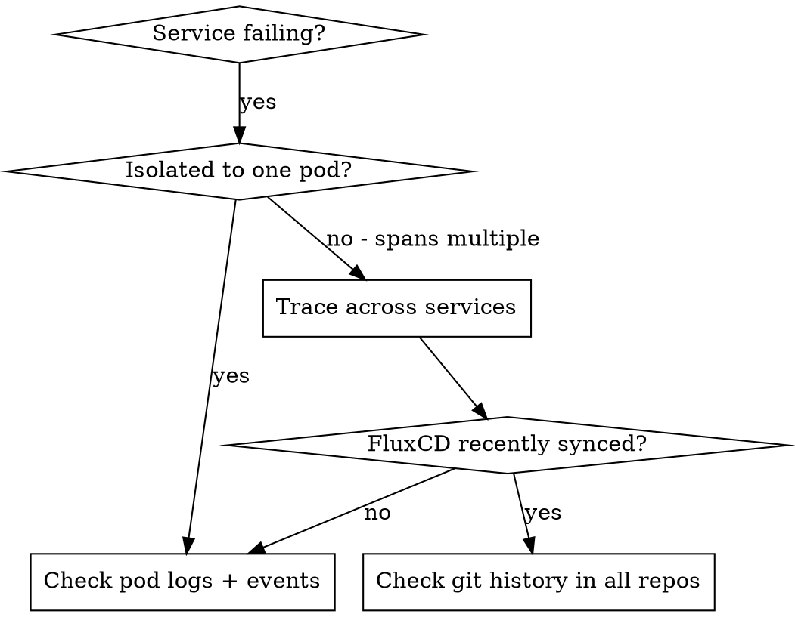
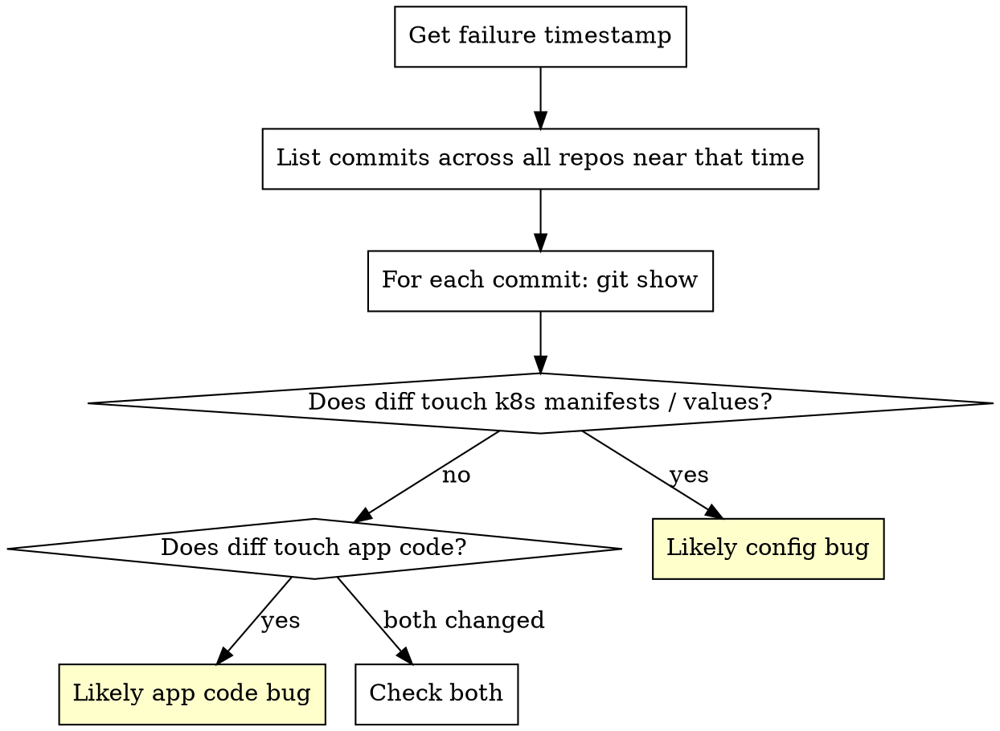

# Kubernetes Microservices Debugging

## Overview

Microservice failures are multi-layered: the error you see is rarely the service that caused it. A broken response may trace back to a config change in another repo deployed minutes ago via FluxCD.

**Core principle:** Correlate logs across services, then verify the deployed state matches git — in all relevant repos.

## When to Use



**Use when:**
- A microservice returns errors but logs alone don't explain it
- Multiple services seem affected
- Errors appeared after a recent deployment
- FluxCD shows reconciliation activity
- You suspect config drift between repos

## Phase 1: Triage — Identify the Blast Radius

### Locate failing pods

```bash
# All non-running pods across all namespaces
kubectl get pods -A --field-selector=status.phase!=Running

# Events sorted by time (recent first)
kubectl get events -A --sort-by='.lastTimestamp' | tail -40

# Quick health overview per namespace
kubectl get pods -n <namespace> -o wide
```

### Check pod state and recent restarts

```bash
kubectl describe pod <pod-name> -n <namespace>
# Look for: Reason, Exit Code, OOMKilled, CrashLoopBackOff, Last State
```

### Map which services call which

Before diving into logs, sketch the call graph mentally or check service mesh / ingress config:

```bash
# See services and their selectors
kubectl get svc -n <namespace> -o wide

# Check ingress rules
kubectl get ingress -A
```

## Phase 2: Log Correlation

### Stream logs with timestamps

```bash
# Current logs
kubectl logs <pod-name> -n <namespace> --timestamps

# Previous container (after crash)
kubectl logs <pod-name> -n <namespace> --previous --timestamps

# Follow live
kubectl logs <pod-name> -n <namespace> -f --timestamps
```

### Multi-pod log aggregation

```bash
# All pods matching a label (e.g., all instances of a service)
kubectl logs -l app=<service-name> -n <namespace> --timestamps --prefix

# Multiple containers in one pod
kubectl logs <pod-name> -n <namespace> -c <container-name> --timestamps
```

### Time-windowed log search

When you know approximately when the failure started:

```bash
# Logs since a specific time
kubectl logs <pod-name> -n <namespace> --since-time="2026-02-16T14:00:00Z"

# Logs from last N minutes
kubectl logs <pod-name> -n <namespace> --since=10m
```

### Correlating across services by request ID / trace ID

If services propagate a correlation ID or trace ID:

```bash
# Search all pods in namespace for a specific trace
for pod in $(kubectl get pods -n <namespace> -o name); do
  echo "=== $pod ===";
  kubectl logs $pod -n <namespace> --timestamps 2>/dev/null | grep "<trace-id>";
done
```

### Log pattern: upstream vs downstream failure

```
Service A → 500 error
Service B (called by A) → connection timeout
Service C (called by B) → CrashLoopBackOff

Root cause: C is crashing → B times out → A returns 500
```

**Rule:** Start from the lowest-level service showing errors, not the one the user hit.

## Phase 3: FluxCD State Inspection

FluxCD manages deployment from git. When something breaks after a sync, git history across ALL managed repos is a primary source of truth.

### Check overall FluxCD health

```bash
# All Flux resources and their ready state
flux get all -A

# Specifically kustomizations (which repos/paths are being applied)
flux get kustomizations -A

# HelmReleases
flux get helmreleases -A
```

### Find recent reconciliations

```bash
# Which kustomizations reconciled recently and their status
flux get kustomizations -A --status-selector ready=false

# Describe a specific kustomization for full event log
flux describe kustomization <name> -n <namespace>

# Equivalent with kubectl
kubectl describe kustomization <name> -n flux-system
```

### Suspend/resume a source to stop cascading changes during debug

```bash
# Pause reconciliation while investigating
flux suspend kustomization <name> -n <namespace>

# Resume when done
flux resume kustomization <name> -n <namespace>
```

### Check what revision is currently deployed

```bash
# Shows git commit SHA currently applied
flux get kustomization <name> -n <namespace>

# For HelmReleases
flux get helmrelease <name> -n <namespace>
```

## Phase 4: Git History Across Multiple Repos

When FluxCD manages multiple repos (app repo, infra repo, config repo), a breaking change may be in any of them.

### Establish the failure timestamp

```bash
# When did the pod first start failing?
kubectl describe pod <pod-name> -n <namespace> | grep -A5 "Last State"

# When did the kustomization last reconcile?
kubectl get kustomization <name> -n flux-system -o jsonpath='{.status.lastHandledReconcileAt}'
```

### Check git log in each repo around that time

For each repo managed by Flux:

```bash
# Recent commits (show author, time, message)
git log --oneline --since="2 hours ago" --format="%h %ai %an: %s"

# Commits touching specific paths (e.g., k8s manifests or helm values)
git log --oneline --since="2 hours ago" -- path/to/manifests/

# Show diff for a specific commit
git show <sha>

# Show what changed in the last N commits
git log -p -n 5 -- path/to/config/
```

### Comparing deployed SHA vs current HEAD

```bash
# Get deployed SHA from Flux
DEPLOYED_SHA=$(kubectl get kustomization <name> -n flux-system \
  -o jsonpath='{.status.lastAppliedRevision}' | cut -d@ -f2)

# What changed between deployed commit and now?
git log --oneline ${DEPLOYED_SHA}..HEAD

# Full diff
git diff ${DEPLOYED_SHA}..HEAD -- path/to/manifests/
```

### Multi-repo workflow: check all repos at once

When you have several repos to check, batch the history lookups:

```bash
# From a parent directory containing all repos
for repo in repo-app repo-infra repo-config; do
  echo "=== $repo ==="
  git -C $repo log --oneline --since="3 hours ago" --format="%h %ai %an: %s"
  echo ""
done
```

### Identify the breaking commit



## Phase 5: ConfigMaps, Secrets, and Environment Drift

Config bugs often aren't visible in pod logs alone.

```bash
# Show current ConfigMap values
kubectl get configmap <name> -n <namespace> -o yaml

# Diff between what's in git and what's live (if using kustomize locally)
kubectl get configmap <name> -n <namespace> -o yaml > /tmp/live.yaml
kustomize build ./path/to/overlay > /tmp/desired.yaml
diff /tmp/live.yaml /tmp/desired.yaml

# Env vars a running pod actually sees
kubectl exec <pod-name> -n <namespace> -- env | sort

# Check if a secret value changed (base64 decode)
kubectl get secret <name> -n <namespace> -o jsonpath='{.data.<key>}' | base64 -d
```

## Phase 6: Rollback Decision

### Via FluxCD (preferred for GitOps)

**Correct approach:** Revert the git commit, let Flux redeploy. Do NOT manually patch pods — Flux will overwrite it.

```bash
# Revert the offending commit in the relevant repo
git revert <bad-sha> --no-edit
git push

# Force Flux to reconcile immediately (don't wait for poll interval)
flux reconcile kustomization <name> -n <namespace> --with-source
```

### Emergency: pin to known-good revision

```bash
# Tell Flux to stay at a specific git ref
flux suspend kustomization <name> -n <namespace>
# Then manually patch or use --revision flag depending on Flux version
# Resume only after git is fixed
```

### Manual rollback (escape hatch only)

```bash
# Roll back a deployment (bypasses Flux — temporary)
kubectl rollout undo deployment/<name> -n <namespace>

# Check rollout history
kubectl rollout history deployment/<name> -n <namespace>
```

## Cheat Sheet: Common Failure Patterns

| Symptom | First command | Likely cause |
|---------|--------------|--------------|
| CrashLoopBackOff | `kubectl logs <pod> --previous` | App panic, missing env var, bad config |
| ImagePullBackOff | `kubectl describe pod <pod>` | Wrong image tag, registry auth |
| 503 from ingress | `kubectl get endpoints -n <ns>` | No ready pods behind service |
| Flux stuck reconciling | `flux get kustomization -A` | Git auth, invalid YAML, policy violation |
| Config value changed unexpectedly | `kubectl describe configmap` + git log | Flux applied a new commit |
| OOMKilled | `kubectl describe pod` + metrics | Memory limit too low or leak |
| DNS resolution failure | `kubectl exec <pod> -- nslookup <svc>` | CoreDNS issue, wrong namespace |

## Debugging Checklist

Before escalating or reverting blindly:

- [ ] Identified which pod/container is the root failure (not just the one the user hit)
- [ ] Checked `--previous` logs for the crashed container
- [ ] Correlated timestamps: when did pod start failing vs when did Flux last reconcile?
- [ ] Checked git log in ALL Flux-managed repos around the failure time
- [ ] Diffed deployed SHA vs HEAD in each repo
- [ ] Verified live ConfigMap/Secret values match what git says they should be
- [ ] Checked for OOMKilled, resource pressure, or node issues
- [ ] Decided: revert in git (preferred) vs manual rollback (escape hatch)

## Key Principles

1. **Logs alone are not enough** — always cross-reference with Flux reconciliation state and git history.
2. **Multiple repos means multiple suspects** — a change in the infra repo can break an app deployed from the app repo.
3. **Never manually patch to fix a GitOps-managed resource** — Flux will revert it. Fix git, let Flux apply.
4. **Timestamp is your anchor** — establish when it broke, then find what changed just before that.
5. **Trace from deepest failure upward** — the surface error is usually downstream of the real cause.
