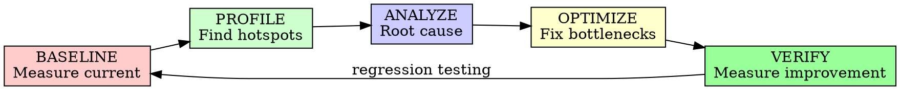

# Performance Review

## Overview

Systematically identify performance bottlenecks and validate that code meets performance requirements. Performance is a feature that affects user experience.

**Core principle:** Premature optimization is bad, but missed optimization is worse.

## When to Use

**Always:**
- Before performance-sensitive features
- When response times degrade
- Before scaling to more users
- After adding complex logic
- When resources are constrained

**Never skip:**
- "We'll optimize later"
- "It works on my machine"
- "Premature optimization is evil" (as excuse to not think about perf)

## The Performance Review Cycle



## Performance Dimensions

### 1. Response Time

```markdown
## Response Time Analysis

### Requirements
- Target p50: [X] ms
- Target p95: [Y] ms
- Target p99: [Z] ms

### Current Measurements
- p50: [Measured] ms
- p95: [Measured] ms
- p99: [Measured] ms

### Analysis
- Meets requirements? [Yes / No]
- Variance: [High / Acceptable]
- Consistency: [Stable / Variable]

### Bottlenecks Identified
1. [Bottleneck 1]: [Impact] ms
   - Location: `file.ts:123`
   - Cause: [Description]
   - Solution: [Recommendation]

2. [Bottleneck 2]: ...
```

### 2. Throughput

```markdown
## Throughput Analysis

### Requirements
- Target RPS: [X] requests/sec
- Concurrent users: [Y]

### Current Capacity
- Max RPS: [Measured]
- Breaking point: [N] concurrent users

### Scaling Analysis
- CPU-bound? [Yes / No]
- Memory-bound? [Yes / No]
- I/O-bound? [Yes / No]
- Database-bound? [Yes / No]

### Throughput Bottlenecks
1. [Component]: [Current capacity] → [Target]
   - Limiting factor: [Description]
   - Scaling strategy: [Recommendation]
```

### 3. Resource Usage

```markdown
## Resource Usage Analysis

### CPU
- Current usage: [X]%
- Peak usage: [Y]%
- Hotspots: [Functions using most CPU]
- Optimization potential: [High / Med / Low]

### Memory
- Current usage: [X] MB
- Peak usage: [Y] MB
- Growth pattern: [Stable / Growing / Leak?]
- Heap allocations: [High frequency?]

### Database
- Query time (avg): [X] ms
- Query time (p95): [Y] ms
- Slow queries: [N queries identified]
- Connection pool usage: [X]%

### Network
- Bandwidth usage: [X] MB/s
- Latency to dependencies: [Y] ms
- API call frequency: [Z calls/sec]
```

### 4. Database Performance

```markdown
## Database Performance Review

### Query Analysis
- N+1 queries: [Found / Not found]
- Missing indexes: [Identified / None]
- Slow queries: [List]
- Full table scans: [Identified / None]

### Connection Management
- Pool size: [Appropriate / Too small / Too large]
- Connection leaks: [Found / None]
- Transaction duration: [Appropriate / Too long]

### Data Access Patterns
- Caching strategy: [Effective / Missing / Ineffective]
- Read/write ratio: [X:Y]
- Bulk operations: [Used / Missing opportunities]

### Optimization Opportunities
1. [ ] Add index on [column]
2. [ ] Implement caching for [query]
3. [ ] Batch [operation]
4. [ ] Denormalize [data]
```

### 5. Algorithm Efficiency

```markdown
## Algorithm Efficiency Review

### Complexity Analysis
- Current: O([n² / n log n / n / etc])
- Optimal: O([n log n / n / log n / etc])
- Impact: [Significant / Minor]

### Data Structure Choices
- Current: [Structure]
- Better alternative: [Structure]
- Tradeoffs: [Memory vs Speed]

### Loop Optimizations
- [ ] Unnecessary iterations
- [ ] Nested loops that could be avoided
- [ ] Early exit opportunities
- [ ] Loop-invariant code motion

### String Operations
- [ ] String concatenation in loops
- [ ] Inefficient regex patterns
- [ ] Unnecessary string copying
```

### 6. Concurrency

```markdown
## Concurrency Review

### Thread Safety
- Race conditions: [Found / None]
- Deadlock potential: [Found / None]
- Proper synchronization: [Yes / No]

### Parallelism
- CPU utilization: [X] cores used of [Y] available
- Parallelization opportunities: [Identified / None]
- Async/await usage: [Effective / Blocking / Missing]

### Resource Contention
- Lock contention: [High / Acceptable / None]
- Shared resource access: [Optimized / Needs work]
- Critical section size: [Minimal / Could be reduced]
```

### 7. Caching Strategy

```markdown
## Caching Review

### Current Caching
- Layers: [None / In-memory / Distributed / CDN]
- Hit rate: [X]%
- Invalidation strategy: [Appropriate / Aggressive / Missing]

### Cacheable Operations
- Database queries: [Identified / None]
- API responses: [Identified / None]
- Computed values: [Identified / None]
- Static assets: [Identified / None]

### Recommendations
1. [ ] Add cache for [operation]
   - Expected improvement: [X]%
   - TTL: [Duration]
   - Invalidation: [Strategy]

2. [ ] Implement multi-level cache
   - L1: [In-memory]
   - L2: [Redis/Memcached]
```

## Performance Review Report

```markdown
# Performance Review Report

## Executive Summary
- **Review Date:** [Date]
- **System:** [Name]
- **Reviewer:** [Name/AI]
- **Overall Status:** MEETS / NEEDS IMPROVEMENT / CRITICAL

## Performance Budget

### Current vs Target
| Metric | Target | Current | Status |
|--------|--------|---------|--------|
| p50 latency | 100ms | 85ms | ✅ |
| p95 latency | 200ms | 350ms | ⚠️ |
| Throughput | 1000 rps | 800 rps | ⚠️ |
| Memory | 512MB | 780MB | ⚠️ |

## Detailed Findings

### Critical Issues
1. **Database N+1 Query**
   - Location: `orders.ts:45`
   - Impact: 300ms per request
   - Fix: Implement eager loading
   - Effort: 2 hours

2. **Memory Leak**
   - Location: `cache.ts:112`
   - Impact: OOM after 2 hours
   - Fix: Proper cleanup
   - Effort: 4 hours

### High Priority
3. **Missing Index**
   - Table: `users`
   - Column: `email`
   - Impact: 50ms per query
   - Fix: Add index
   - Effort: 30 minutes

### Medium Priority
4. **Inefficient Algorithm**
   - Location: `search.ts:78`
   - Current: O(n²)
   - Optimal: O(n log n)
   - Impact: 20% improvement
   - Effort: 1 day

## Optimization Plan

### Phase 1: Critical (Immediate)
- [ ] Fix N+1 queries
- [ ] Fix memory leak
- Expected improvement: 60% latency reduction

### Phase 2: High Priority (This week)
- [ ] Add database indexes
- [ ] Implement caching layer
- Expected improvement: 30% latency reduction

### Phase 3: Medium Priority (Next sprint)
- [ ] Optimize algorithms
- [ ] Improve concurrency
- Expected improvement: 15% throughput increase

## Recommendations

### Quick Wins (< 1 hour)
1. Add missing indexes
2. Remove unused dependencies
3. Enable gzip compression

### Medium Effort (1 day)
1. Implement query caching
2. Optimize hot paths
3. Add connection pooling

### Large Effort (1 week)
1. Architecture optimization
2. Database denormalization
3. Async processing

## Testing Plan

### Load Testing
- [ ] Simulate 2x expected load
- [ ] Test with production-like data
- [ ] Monitor resource usage

### Regression Testing
- [ ] Verify optimizations don't break functionality
- [ ] Test edge cases
- [ ] Validate error handling

## Monitoring

### Metrics to Track
- [ ] Response time (p50, p95, p99)
- [ ] Throughput (requests/sec)
- [ ] Error rate
- [ ] Resource utilization (CPU, memory)
- [ ] Database query time

### Alerts
- [ ] Latency > target for 5 minutes
- [ ] Error rate > 1%
- [ ] Memory usage > 80%
- [ ] CPU usage > 90%

## Approval

**Performance Review Status:**
- [ ] Approved - Meets all requirements
- [ ] Approved with conditions - Must address critical issues
- [ ] Not approved - Significant optimization needed

**Approved by:** [Name] **Date:** [Date]
```

## Performance Optimization Patterns

### Common Optimizations

| Issue | Pattern | Impact |
|-------|---------|--------|
| N+1 Queries | Eager loading | 50-90% faster |
| Missing Index | Add index | 10-100x faster |
| String Concatenation | StringBuilder/join | 10x faster |
| Synchronous I/O | Async/await | Better concurrency |
| Repeated Computation | Memoization | Avoid redundant work |
| Large Payloads | Pagination | 90% size reduction |
| Database Round-trips | Batching | 50% fewer queries |

### Anti-Patterns to Avoid

❌ Optimizing without measuring
❌ Optimizing everything (focus on hot paths)
❌ Adding complexity for minor gains
❌ Ignoring memory for speed
❌ Caching without invalidation strategy
❌ Denormalizing without need

## Performance Budget

### Setting Budgets

```markdown
## Performance Budget

### Page Load Budget
- Total: 3 seconds
- HTML: 500ms
- CSS: 200ms
- JS: 500ms
- Images: 1000ms
- API calls: 800ms

### API Response Budget
- Simple queries: < 100ms
- Complex queries: < 300ms
- Report generation: < 2s
- Bulk operations: < 5s

### Resource Budget
- Bundle size: < 200KB gzipped
- Images: < 100KB each
- Memory per request: < 50MB
- CPU per request: < 100ms
```

## Tools & Measurement

### Profiling Tools
- CPU Profiling: perf, pprof, Chrome DevTools
- Memory Profiling: heap snapshots, valgrind
- Database: EXPLAIN ANALYZE, slow query log
- Network: Wireshark, tcpdump

### Benchmarking
- Load testing: k6, Artillery, Locust
- Unit benchmarks: built-in timing
- A/B testing for optimizations

## Integration with AI-DLC

### Inception Phase
- Define performance requirements
- Set performance budgets
- Identify optimization needs

### Construction Phase
- Code-level optimization
- Performance testing
- Profiling and tuning

### Operations Phase
- Performance monitoring
- Capacity planning
- Optimization based on real data

## Best Practices

### Do's

✅ Measure before optimizing
✅ Focus on hot paths (80/20 rule)
✅ Test optimizations thoroughly
✅ Monitor in production
✅ Document performance decisions
✅ Consider tradeoffs (complexity vs speed)

### Don'ts

❌ Optimize without profiling
❌ Sacrifice readability for micro-optimizations
❌ Ignore mobile/lower-end devices
❌ Skip load testing
❌ Forget about memory usage
❌ Over-engineer prematurely

## Final Rule

```
Measure → Profile → Optimize → Verify

Guess-based optimization? You're probably wrong.
```

No exceptions without your human partner's permission.
