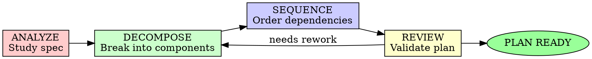
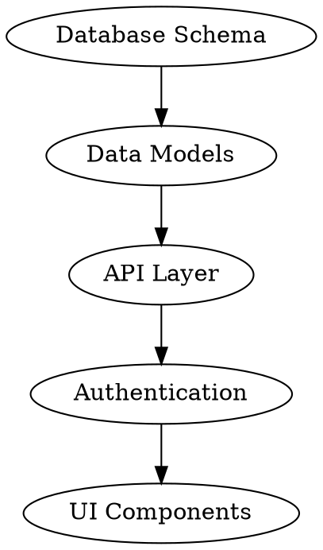

# Implementation Planning

## Overview

Transform specifications into executable plans. Planning bridges the gap between WHAT (spec) and HOW (code).

**Core principle:** A plan without dependencies is a wishlist.

**Violating the letter of the rules is violating the spirit of the rules.**

## AI-DLC Phase: CONSTRUCTION

This skill is part of the **Construction Phase** in AI-DLC (AI-Driven Development Lifecycle).

**Construction Goal:** Using validated context from Inception, propose architecture and implementation through collaborative mob construction.

**Construction Flow:**
```
Spec + Context → Mob Construction → Architecture → Implementation Plan → Code
```

**Previous Phase:** Inception (requirements elaboration)

**Next Phase:** Operations (deployment and monitoring)

## When to Use

**Always:**
- Spec is complete and approved
- Before writing implementation code
- When estimating work
- When multiple components interact

**Never start implementation:**
- Without understanding dependencies
- Without knowing the sequence
- Without identifying risks

## The Iron Law

```
NO CODE WITHOUT A PLAN
```

Start coding from a spec alone? Stop. Plan first.

**No exceptions:**
- Don't "just start" and figure it out
- Don't assume the path is obvious
- Don't skip planning for "simple" features

## The Planning Cycle



## Phase 1: ANALYZE - Deep Spec Study

### Understand Requirements

Read the specification thoroughly:

1. **Functional requirements**: What must be built?
2. **Non-functional requirements**: Constraints and qualities?
3. **Integration points**: What does this touch?
4. **Data flow**: How does information move?
5. **State management**: What persists? What transforms?

### Identify Unknowns

Mark anything unclear:
- Unfamiliar libraries/frameworks
- Uncertain performance characteristics
- Missing environment details
- Unclear error scenarios

**Decision:** Research now or spike later?

## Phase 2: DECOMPOSE - Component Breakdown

### Identify Components

Break the spec into logical pieces:

```
Feature: User Authentication
├── Component: Login UI
├── Component: Session Management
├── Component: Password Validation
├── Component: OAuth Integration
└── Component: Rate Limiting
```

### Component Specification

Each component needs:

```markdown
### Component: [Name]
**Purpose:** One-sentence description
**Inputs:** What it receives
**Outputs:** What it produces
**Dependencies:** What it needs first
**Complexity:** Low/Medium/High
**Risks:** Potential blockers
```

<Good Component>
```markdown
### Component: Session Management
**Purpose:** Handle user session lifecycle
**Inputs:** User credentials, session config
**Outputs:** Session token, expiry info
**Dependencies:** Database schema, crypto library
**Complexity:** Medium
**Risks:** Session fixation attacks if not implemented correctly
```
</Good Component>

<Bad Component>
```markdown
### Component: Backend stuff
**Purpose:** Handle things
**Inputs:** Data
**Outputs:** Results
**Dependencies:** None
**Complexity:** Low
**Risks:** None
```
</Bad Component>

### Component Boundaries

Define clear interfaces between components:

```typescript
// Component A contract
interface UserService {
  authenticate(credentials: Credentials): Promise<AuthResult>;
  validateSession(token: string): Promise<SessionStatus>;
}

// Component B uses the contract
class SessionManager {
  constructor(private userService: UserService) {}
  // Implementation
}
```

## Phase 3: SEQUENCE - Dependency Ordering

### Map Dependencies

Create a dependency graph:



### Determine Sequence

Order components by dependency:

1. **Foundation first**: Database, models, core utilities
2. **Services next**: Business logic, APIs
3. **Integration**: External services, auth
4. **Presentation**: UI, CLI, interfaces
5. **Polish**: Error handling, logging, monitoring

### Parallel Workstreams

Identify what can be done in parallel:

```markdown
**Workstream A (Backend):**
1. Database schema
2. Data models
3. API endpoints

**Workstream B (Frontend):**
1. Mock data
2. UI components
3. Integration (waits for Workstream A)
```

## Phase 4: REVIEW - Plan Validation

### Completeness Check

- [ ] Every spec requirement maps to a component
- [ ] Every component has clear inputs/outputs
- [ ] Dependencies form a DAG (no cycles)
- [ ] Critical path identified
- [ ] Risks have mitigation strategies
- [ ] Integration points documented

### Risk Assessment

| Risk | Likelihood | Impact | Mitigation |
|------|-----------|--------|------------|
| Auth library incompatible | Medium | High | Spike first, have fallback |
| Performance requirements unmeetable | Low | High | Prototype critical path early |
| Third-party API changes | Medium | Medium | Abstract behind adapter |

### Planning Anti-Patterns

| Anti-Pattern | Why It Fails | Fix |
|--------------|--------------|-----|
| "We'll do it all at once" | No incremental progress | Sequential delivery |
| Big bang integration | Integration hell at the end | Integrate early and often |
| No dependency analysis | Blocked waiting constantly | Map dependencies first |
| Optimistic estimates | Always behind schedule | Buffer for unknowns |
| "We'll refactor later" | Technical debt accumulates | Build quality in |

## Plan Structure

```markdown
# Implementation Plan: [Feature Name]

## Overview
Brief summary of approach and key decisions.

## Architecture Decision
**Pattern:** [e.g., Clean Architecture, MVC, Microservices]
**Rationale:** Why this pattern fits

## Component Breakdown

### Component 1: [Name]
**Purpose:** ...
**Inputs:** ...
**Outputs:** ...
**Dependencies:** ...
**Complexity:** ...
**Files to create/modify:**
- `src/services/feature.ts`
- `src/types/feature.ts`

### Component 2: [Name]
...

## Execution Sequence

### Phase 1: Foundation
1. [Component] - [Rationale]
2. [Component] - [Rationale]

### Phase 2: Core Implementation
1. [Component] - [Rationale]
2. [Component] - [Rationale]

### Phase 3: Integration & Polish
1. [Component] - [Rationale]

## Technical Specifications

### Data Models
```typescript
interface User {
  id: string;
  email: string;
  // ...
}
```

### API Contracts
```typescript
// Interface definitions
```

### Error Handling Strategy
- Strategy for different error types
- Retry policies
- Fallback behaviors

## Testing Strategy

### Unit Tests
- Components requiring unit tests
- Mocking strategy

### Integration Tests
- Integration points to test
- Test data approach

### E2E Tests
- Critical user journeys
- Test environment needs

## Open Questions
1. [Question that affects planning]
2. [Another question]

## Appendix
- Reference links
- Spike results
- Architecture diagrams
```

## Plan → Implementation Handoff

The plan becomes the roadmap:
1. AI uses plan to generate task lists
2. Each component has clear acceptance criteria
3. Dependencies guide execution order
4. Reviews check against plan

## Example: E-commerce Checkout

<Weak Plan>
```
Build the checkout flow.
1. Create checkout page
2. Add payment processing
3. Send confirmation email
```
</Weak Plan>

<Strong Plan>
```markdown
# Implementation Plan: Checkout Flow

## Architecture
**Pattern:** Transactional Saga
**Rationale:** Must handle partial failures gracefully

## Components

### Component 1: Cart Service
**Purpose:** Manage cart state
**Inputs:** Add/remove items, user session
**Outputs:** Cart snapshot
**Dependencies:** Database
**Files:** `src/services/cart.ts`, `src/models/cart.ts`

### Component 2: Pricing Engine
**Purpose:** Calculate totals with discounts
**Inputs:** Cart items, user tier, promotions
**Outputs:** Priced cart
**Dependencies:** Cart Service
**Files:** `src/services/pricing.ts`

### Component 3: Payment Gateway
**Purpose:** Process payments
**Inputs:** Payment method, priced cart
**Outputs:** Payment confirmation
**Dependencies:** Pricing Engine, Stripe API
**Files:** `src/services/payment.ts`

### Component 4: Order Service
**Purpose:** Create and track orders
**Inputs:** Payment confirmation
**Outputs:** Order record
**Dependencies:** Payment Gateway, Database
**Files:** `src/services/order.ts`

### Component 5: Notification Service
**Purpose:** Send confirmations
**Inputs:** Order record
**Outputs:** Email/SMS
**Dependencies:** Order Service, SendGrid API
**Files:** `src/services/notification.ts`

## Sequence

**Phase 1 - Foundation:**
1. Database schema (carts, orders, payments)
2. Cart Service
3. Pricing Engine

**Phase 2 - Core:**
4. Payment Gateway (with Stripe sandbox)
5. Order Service

**Phase 3 - Integration:**
6. Notification Service
7. Checkout UI
8. Error handling & rollback

## Risk: Payment Failures
**Mitigation:** Implement idempotency keys, save payment intent before charging
```
</Strong Plan>

## Final Rule

```
Spec → Plan → Tasks → Code → Test

Skip the plan? You don't know what to build in what order.
```

No exceptions without your human partner's permission.
