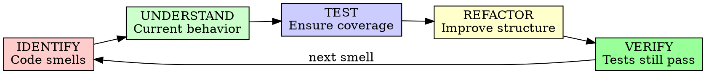

# Refactoring

## Overview

Systematically improve code quality without changing external behavior. Refactoring is not rewriting - it's restructuring while maintaining functionality.

**Core principle:** Refactoring should be safe, incremental, and reversible.

## When to Use

**Always:**
- Code has technical debt
- Adding features is getting harder
- Tests are difficult to write
- Understanding code takes too long
- Performance needs improvement

**Never skip:**
- "We'll refactor it later"
- "Just rewrite it"
- "Skip the tests, it's the same logic"

## The Refactoring Cycle



## Code Smells

### Bloaters

**Long Method:**
```typescript
// Smell: Method doing too much
function processOrder(order) {
  // 200 lines of code
  // Validation, calculation, saving, emailing, logging
}

// Refactored: Extract smaller methods
function processOrder(order) {
  validateOrder(order);
  const total = calculateTotal(order);
  saveOrder(order, total);
  sendConfirmation(order);
  logOrderProcessed(order);
}
```

**Large Class:**
```typescript
// Smell: Class with too many responsibilities
class OrderService {
  // Handles validation, calculation, persistence, notification
  // 50+ methods
}

// Refactored: Split into focused classes
class OrderValidator { }
class OrderCalculator { }
class OrderRepository { }
class OrderNotifier { }
```

**Primitive Obsession:**
```typescript
// Smell: Using primitives for domain concepts
function createUser(firstName: string, lastName: string, email: string, phone: string)

// Refactored: Use value objects
function createUser(name: PersonName, email: Email, phone: PhoneNumber)
```

### Object-Orientation Abusers

**Switch Statements:**
```typescript
// Smell: Switch on type
function calculateShipping(order) {
  switch(order.type) {
    case 'standard': return 5;
    case 'express': return 15;
    case 'free': return 0;
  }
}

// Refactored: Polymorphism
interface ShippingStrategy {
  calculate(order): number;
}
class StandardShipping implements ShippingStrategy { }
class ExpressShipping implements ShippingStrategy { }
```

**Temporary Field:**
```typescript
// Smell: Fields only used in some methods
class OrderProcessor {
  private tempDiscount: number; // Only used in calculate()
  
  calculate(order) {
    this.tempDiscount = getDiscount(order);
    // ...
  }
}

// Refactored: Pass as parameter
class OrderProcessor {
  calculate(order, discount: number) {
    // ...
  }
}
```

### Change Preventers

**Divergent Change:**
```typescript
// Smell: One class changes for many reasons
class Report {
  // Changes when report format changes
  // Changes when data source changes
  // Changes when output format changes
}

// Refactored: Separate concerns
class ReportData { }
class ReportFormatter { }
class ReportExporter { }
```

**Shotgun Surgery:**
```typescript
// Smell: One change requires many small edits
// Adding a new field requires changes in 10 files

// Refactored: Consolidate
// Single source of truth for the concept
```

### Dispensables

**Comments:**
```typescript
// Smell: Comments explaining bad code
// Increment i by 1
i++;

// Refactored: Self-documenting code
nextIndex = currentIndex + 1;
```

**Duplicated Code:**
```typescript
// Smell: Same logic in multiple places
// Extract method or use inheritance/composition
```

**Dead Code:**
```typescript
// Smell: Unused methods, variables, imports
// Delete them
```

**Speculative Generality:**
```typescript
// Smell: Unused abstractions "just in case"
// YAGNI - You Ain't Gonna Need It
```

### Couplers

**Feature Envy:**
```typescript
// Smell: Method uses more features of another class
class Order {
  getDiscount() {
    return this.customer.getTier() === 'gold' ? 0.2 : 0; // Envies Customer
  }
}

// Refactored: Move method to Customer
class Customer {
  getDiscount(): number {
    return this.tier === 'gold' ? 0.2 : 0;
  }
}
```

**Inappropriate Intimacy:**
```typescript
// Smell: Classes know too much about each other
// Reduce coupling, use interfaces
```

## Refactoring Techniques

### Extract Method

```typescript
// Before: Long method
function printOwing(invoice) {
  console.log("Invoice");
  console.log("========");
  
  let outstanding = 0;
  for (const o of invoice.orders) {
    outstanding += o.amount;
  }
  
  console.log(`name: ${invoice.customer}`);
  console.log(`amount: ${outstanding}`);
}

// After: Extract smaller methods
function printOwing(invoice) {
  printBanner();
  const outstanding = calculateOutstanding(invoice);
  printDetails(invoice, outstanding);
}

function printBanner() {
  console.log("Invoice");
  console.log("========");
}

function calculateOutstanding(invoice) {
  return invoice.orders.reduce((sum, o) => sum + o.amount, 0);
}

function printDetails(invoice, outstanding) {
  console.log(`name: ${invoice.customer}`);
  console.log(`amount: ${outstanding}`);
}
```

### Inline Method

```typescript
// Before: Method adds no value
function getRating() {
  return moreThanFiveLateDeliveries() ? 2 : 1;
}

function moreThanFiveLateDeliveries() {
  return this.lateDeliveries > 5;
}

// After: Inline
function getRating() {
  return this.lateDeliveries > 5 ? 2 : 1;
}
```

### Extract Variable

```typescript
// Before: Complex expression
if (platform.toUpperCase().indexOf("MAC") > -1 && 
    browser.toUpperCase().indexOf("IE") > -1 && 
    wasInitialized() && resize > 0) {
  // do something
}

// After: Named variables
const isMacOs = platform.toUpperCase().indexOf("MAC") > -1;
const isIEBrowser = browser.toUpperCase().indexOf("IE") > -1;
const wasResized = resize > 0;

if (isMacOs && isIEBrowser && wasInitialized() && wasResized) {
  // do something
}
```

### Rename Variable/Method

```typescript
// Before: Unclear names
const d = new Date();
const y = d.getFullYear();

// After: Clear names
const currentDate = new Date();
const currentYear = currentDate.getFullYear();
```

### Replace Conditional with Polymorphism

```typescript
// Before: Switch on type
function getSpeed(bird) {
  switch(bird.type) {
    case 'european': return 35;
    case 'african': return bird.numCoconuts > 2 ? 35 - 2 : 35;
    case 'norwegian': return bird.isNailed ? 0 : 35 + bird.voltage;
  }
}

// After: Polymorphism
class Bird {
  getSpeed() { return 35; }
}

class AfricanBird extends Bird {
  getSpeed() { 
    return this.numCoconuts > 2 ? 35 - 2 : 35; 
  }
}

class NorwegianBird extends Bird {
  getSpeed() { 
    return this.isNailed ? 0 : 35 + this.voltage; 
  }
}
```

### Introduce Parameter Object

```typescript
// Before: Long parameter list
function createAppointment(
  startDate: Date,
  endDate: Date,
  startTime: string,
  endTime: string,
  room: string
) { }

// After: Parameter object
interface TimeRange {
  start: DateTime;
  end: DateTime;
  room: string;
}

function createAppointment(timeRange: TimeRange) { }
```

## Refactoring Process

### Step 1: Ensure Test Coverage

```markdown
## Pre-Refactoring Checklist

- [ ] Existing tests cover the code to refactor
- [ ] Tests pass before refactoring
- [ ] If no tests: Write characterization tests first
  - Run code with various inputs
  - Record outputs
  - Create tests that verify current behavior
- [ ] Code coverage > 80% for affected code
```

### Step 2: Make Small Changes

```markdown
## Refactoring Rules

1. **One change at a time**
   - Extract one method
   - Rename one variable
   - Move one method

2. **Commit after each change**
   ```bash
   git add . && git commit -m "refactor: extract calculateTotal method"
   ```

3. **Run tests after each change**
   - Tests must pass
   - If tests fail, undo and try again

4. **Don't mix refactoring with behavior changes**
   - Refactor OR add features, never both
```

### Step 3: Characterization Tests

When refactoring untested code:

```typescript
// Capture current behavior
describe('OrderProcessor (characterization)', () => {
  it('current behavior with order A', () => {
    const result = processor.process({ id: 'A', amount: 100 });
    expect(result).toEqual(/* captured output */);
  });
  
  it('current behavior with order B', () => {
    const result = processor.process({ id: 'B', amount: 0 });
    expect(result).toEqual(/* captured output */);
  });
});
```

## Refactoring Safety

### Golden Rule

```
Red → Green → Refactor

Always be in a "green" state when refactoring.
If tests fail during refactoring:
1. Undo last change
2. Get back to green
3. Try smaller steps
```

### Version Control

```bash
# Commit frequently during refactoring
git add . && git commit -m "refactor: extract validation logic"

# If something goes wrong
git checkout -- .

# Or revert specific commit
git revert HEAD
```

### IDE Support

Use IDE refactoring tools (safer than manual):
- Extract Method (Ctrl+Alt+M in IntelliJ)
- Rename (Shift+F6)
- Inline (Ctrl+Alt+N)
- Move Method
- Change Signature

## When NOT to Refactor

**Don't refactor when:**
- [ ] You don't understand the code well
- [ ] No tests exist and you can't write them
- [ ] Deadline is imminent
- [ ] You're adding new features (do it after)
- [ ] Code is going to be deleted soon

**Do rewrite instead when:**
- Code is fundamentally broken
- Architecture is wrong
- Technology is obsolete
- Tests would be meaningless

## Refactoring Checklist

### Before Starting
- [ ] Understand current behavior
- [ ] Tests exist and pass
- [ ] Version control clean
- [ ] Time allocated (not during crunch)

### During Refactoring
- [ ] Small, incremental changes
- [ ] Commit after each change
- [ ] Tests pass after each change
- [ ] No behavior changes

### After Refactoring
- [ ] All tests pass
- [ ] Code coverage maintained
- [ ] Code is cleaner
- [ ] No functionality lost
- [ ] Performance not degraded
- [ ] Team review completed

## Refactoring Review

### Review Checklist

```markdown
## Refactoring Review

**Code Smells Addressed:**
- [ ] Long methods extracted
- [ ] Large classes split
- [ ] Duplication removed
- [ ] Naming improved
- [ ] Coupling reduced

**Quality Metrics:**
- Cyclomatic complexity: [Before] → [After]
- Lines of code: [Before] → [After]
- Test coverage: [Before]% → [After]%
- Code duplication: [Before]% → [After]%

**Verification:**
- [ ] All tests pass
- [ ] No behavior changes
- [ ] Performance comparable or better
- [ ] Code is more readable
- [ ] Code is more maintainable
```

## Refactoring vs. Rewriting

| Aspect | Refactoring | Rewriting |
|--------|-------------|-----------|
| Risk | Low | High |
| Time | Incremental | All at once |
| Tests | Existing guide | New tests needed |
| Rollback | Easy | Hard |
| When | Code works but messy | Code fundamentally broken |

## Best Practices

### Do's

✅ Refactor in small, safe steps
✅ Maintain comprehensive tests
✅ Use IDE refactoring tools
✅ Commit after each change
✅ Review with team
✅ Measure improvement (complexity, readability)
✅ Document why (not just what)

### Don'ts

❌ Refactor without tests
❌ Mix refactoring with feature work
❌ Do large refactors in one go
❌ Skip code review
❌ Ignore performance impact
❌ Refactor unfamiliar code
❌ Refactor under pressure

## Integration with AI-DLC

### Construction Phase
- Continuous refactoring
- Technical debt reduction
- Code quality maintenance

### Operations Phase
- Refactoring for performance
- Hot path optimization
- Maintainability improvements

## Final Rule

```
Refactoring:
- Improves structure (not behavior)
- Requires tests (safety net)
- Is incremental (small steps)
- Needs discipline (green → refactor → green)

Refactor without tests? You're guessing.
```

No exceptions without your human partner's permission.
