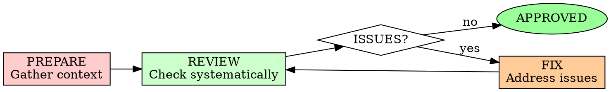

# Code Review

## Overview

Verify implementation matches specification and meets quality standards. A review is the gate between "it works" and "it's right."

**Core principle:** Code review finds what testing misses.

**Violating the letter of the rules is violating the spirit of the rules.**

## When to Use

**Always:**
- Implementation claims to be complete
- Before marking work done
- Before merging to main branch
- When tests are all passing

**Never skip:**
- "I tested it manually"
- "It's just a small change"
- "The AI wrote it, so it's fine"

## The Iron Law

```
NO MERGE WITHOUT REVIEW
```

Ready to mark done? Stop. Review first.

**No exceptions:**
- Don't trust tests alone
- Don't skip for "obvious" fixes
- Don't review your own code alone

## The Review Cycle



## Phase 1: PREPARE - Gather Context

### What to Review

Before starting, collect:
1. **Specification**: What should this do?
2. **Implementation Plan**: How was it supposed to be built?
3. **Task List**: What were the acceptance criteria?
4. **Code Changes**: What actually changed?
5. **Test Results**: Do tests pass?

### Review Checklist Setup

Create a mental framework:
- **Correctness**: Does it work as specified?
- **Quality**: Is the code well-crafted?
- **Security**: Are there vulnerabilities?
- **Performance**: Are there bottlenecks?
- **Maintainability**: Can others understand this?

## Phase 2: REVIEW - Systematic Checking

### 1. Specification Compliance

Verify every requirement is met:

```markdown
## Spec Compliance Check

### Functional Requirements
- [ ] Req 1: [Description] - IMPLEMENTED / MISSING
- [ ] Req 2: [Description] - IMPLEMENTED / MISSING

### Edge Cases
- [ ] Empty input handling
- [ ] Error scenarios
- [ ] Boundary conditions

### API Contracts
- [ ] Request format matches spec
- [ ] Response format matches spec
- [ ] Error codes match spec
```

**Rule:** If it's not in the spec, question if it should be there.

### 2. Correctness

Check the logic:

```markdown
## Correctness Review

### Logic Errors
- [ ] No obvious bugs or logic flaws
- [ ] Error handling for all failure paths
- [ ] Null/undefined checks where needed
- [ ] Race conditions considered

### Algorithm Review
- [ ] Algorithm matches intended approach
- [ ] Time complexity acceptable
- [ ] Space complexity acceptable
- [ ] Edge cases in algorithm handled
```

### 3. Test Coverage

Verify testing is thorough:

```markdown
## Test Review

### Unit Tests
- [ ] Happy paths covered
- [ ] Edge cases tested
- [ ] Error conditions tested
- [ ] TDD followed (tests fail → pass pattern)

### Integration Tests
- [ ] Component interactions tested
- [ ] External services mocked appropriately
- [ ] Database operations tested

### Test Quality
- [ ] Test names describe behavior
- [ ] Assertions specific and meaningful
- [ ] No tests just for coverage
- [ ] Tests are maintainable
```

### 4. Code Quality

Assess craftsmanship:

```markdown
## Quality Check

### Readability
- [ ] Clear, descriptive names
- [ ] Functions do one thing
- [ ] No magic numbers/strings
- [ ] Comments explain why, not what

### Structure
- [ ] Consistent with codebase patterns
- [ ] Appropriate abstractions
- [ ] No unnecessary complexity
- [ ] SOLID principles followed

### Error Handling
- [ ] Specific error types
- [ ] Meaningful error messages
- [ ] Proper error propagation
- [ ] No swallowed exceptions
```

### 5. Security

Check for vulnerabilities:

```markdown
## Security Review

### Input Validation
- [ ] All user input validated
- [ ] No SQL injection possible
- [ ] No command injection possible
- [ ] File uploads validated

### Authentication/Authorization
- [ ] Endpoints properly protected
- [ ] Privilege escalation prevented
- [ ] Session management secure

### Data Protection
- [ ] Sensitive data not logged
- [ ] PII handled correctly
- [ ] Secrets not hardcoded
- [ ] Encryption where needed

### Dependencies
- [ ] No known vulnerabilities in deps
- [ ] Minimal dependency tree
- [ ] Trusted sources only
```

### 6. Performance

Identify bottlenecks:

```markdown
## Performance Review

### Efficiency
- [ ] No N+1 queries
- [ ] No unnecessary loops
- [ ] Caching used appropriately
- [ ] Lazy loading where beneficial

### Resource Usage
- [ ] Memory leaks prevented
- [ ] Large data sets handled
- [ ] Streaming for large files
- [ ] Connection pooling used

### Scalability
- [ ] Async/await for I/O
- [ ] No blocking operations
- [ ] Thread safety considered
```

## Phase 3: ISSUES - Document Findings

### Issue Classification

| Severity | Definition | Action Required |
|----------|-----------|----------------|
| **Blocker** | Wrong behavior, security vuln, data loss | Must fix before merge |
| **Critical** | Significant bug, performance issue | Should fix before merge |
| **Major** | Design flaw, maintainability issue | Fix or discuss |
| **Minor** | Style issue, nitpick | Nice to have |
| **Question** | Need clarification | Ask and resolve |

### Issue Format

```markdown
### Issue [Number]: [Severity] - [Category]
**Location:** `file.ts:42`

**Problem:**
Description of what's wrong

**Impact:**
What could go wrong

**Recommendation:**
How to fix it

**Why:**
Explanation of the principle
```

### Example Issues

<Good Issue>
```markdown
### Issue 1: BLOCKER - Security
**Location:** `src/api/login.ts:28`

**Problem:**
Password comparison uses `==` instead of timing-safe comparison

**Impact:**
Timing attack could reveal valid usernames

**Recommendation:**
Use `crypto.timingSafeEqual()` for comparison

**Why:**
Regular comparison short-circuits on first mismatch, revealing info via timing
```
</Good Issue>

<Bad Issue>
```markdown
Issue: This looks wrong

Maybe fix it?
```
</Bad Issue>

## Phase 4: FIX - Address Issues

### Fix Priority

1. **Blockers**: Fix immediately
2. **Critical**: Fix or discuss with human
3. **Major**: Consider tradeoffs
4. **Minor**: Fix if time permits
5. **Questions**: Get answers

### Fix Verification

After fixing:
- [ ] Re-review the changed code
- [ ] Run tests again
- [ ] Verify fix addresses the issue
- [ ] Check for regressions

## Review Report Template

```markdown
# Code Review Report

## Summary
- **Review Date:** [Date]
- **Reviewer:** [Name]
- **Code Author:** [Name/AI]
- **Overall Status:** APPROVED / CHANGES REQUESTED / REJECTED

## Statistics
- **Total Issues:** 12
  - Blockers: 1
  - Critical: 2
  - Major: 3
  - Minor: 6
- **Lines Reviewed:** 450
- **Files Changed:** 8

## Compliance Check

### Specification
- [x] All functional requirements met
- [x] All edge cases handled
- [x] API contracts followed

### Test Coverage
- [x] Unit tests: 94%
- [x] Integration tests: Present
- [ ] E2E tests: Missing (acceptable for now)

### Quality Metrics
- [x] No lint errors
- [x] No type errors
- [x] Code complexity acceptable

## Issues Found

### Blockers (Must Fix)
1. [Issue details]

### Critical (Should Fix)
1. [Issue details]
2. [Issue details]

### Major (Consider)
1. [Issue details]

### Minor (Optional)
1. [Issue details]
...

## Positive Findings
- Clean separation of concerns
- Good test coverage
- Clear naming conventions

## Recommendations
- [ ] Add E2E tests for critical path
- [ ] Consider refactoring [component] in future
- [ ] Document [complex logic]

## Conclusion
**Status:** CHANGES REQUESTED

**Required Actions:**
1. Fix timing attack vulnerability
2. Add input validation
3. Address performance concern

**After fixes:** Ready for merge
```

## Review Anti-Patterns

| Anti-Pattern | Why It Fails | Fix |
|--------------|--------------|-----|
| "LGTM" without reading | Misses bugs | Systematic checklist |
| Only checking style | Misses logic errors | Multi-dimension review |
| Not checking against spec | Builds wrong thing | Spec compliance first |
| Reviewing your own code | Blind spots | Fresh eyes or tools |
| Nitpicking everything | Slows delivery | Severity classification |

## Final Rule

```
Implementation → Review → Fix → Approve → Merge

Skip the review? You're trusting without verifying.
```

No exceptions without your human partner's permission.
