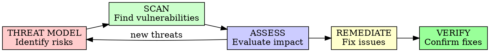

# Security Review

## Overview

Systematically identify security vulnerabilities and validate that security controls are properly implemented. Security is not a feature - it's a foundation.

**Core principle:** Security vulnerabilities are bugs that attackers will find.

## When to Use

**Always:**
- Before merging code to main
- Before deploying to production
- When handling sensitive data
- When adding authentication/authorization
- When processing user input

**Never skip:**
- "It's just internal"
- "We'll add security later"
- "The framework handles it"

## The Security Review Cycle



## Review Areas

### 1. Input Validation

```markdown
## Input Validation Review

### User Input Points
- [ ] API endpoints validate all input
- [ ] Form inputs sanitized
- [ ] File uploads validated (type, size)
- [ ] Query parameters validated
- [ ] Headers validated

### Validation Checks
- [ ] Type validation (schema validation)
- [ ] Range validation (min/max values)
- [ ] Format validation (regex patterns)
- [ ] Length validation (buffer overflow prevention)
- [ ] Business rule validation

### Common Vulnerabilities
- [ ] SQL Injection: [Safe / Vulnerable / Needs check]
- [ ] NoSQL Injection: [Safe / Vulnerable / Needs check]
- [ ] Command Injection: [Safe / Vulnerable / Needs check]
- [ ] Path Traversal: [Safe / Vulnerable / Needs check]
- [ ] XSS (Cross-Site Scripting): [Safe / Vulnerable / Needs check]
```

### 2. Authentication

```markdown
## Authentication Review

### Authentication Mechanism
**Type:** [JWT / OAuth 2.0 / Session / API Key / etc]

**Strength Assessment:**
- [ ] Password policy enforced (min length, complexity)
- [ ] Brute force protection (rate limiting, lockout)
- [ ] Multi-factor authentication available
- [ ] Session management secure
- [ ] Token lifecycle appropriate (expiry, refresh)

### Vulnerability Checks
- [ ] No hardcoded credentials
- [ ] No credential leakage in logs
- [ ] Secure password storage (bcrypt/argon2, not MD5/SHA1)
- [ ] Session fixation protection
- [ ] Secure session ID generation
- [ ] Proper logout (invalidate server-side)

### JWT-Specific (if applicable)
- [ ] Algorithm explicitly specified (none not allowed)
- [ ] Signature validated
- [ ] Expiration checked
- [ ] No sensitive data in payload
- [ ] Refresh token rotation
```

### 3. Authorization

```markdown
## Authorization Review

### Access Control Model
**Model:** [RBAC / ABAC / ACL / etc]

**Implementation Checks:**
- [ ] Principle of least privilege followed
- [ ] Role hierarchy appropriate
- [ ] Permission checks on every endpoint
- [ ] No security by obscurity
- [ ] Admin functionality properly protected

### Common Issues
- [ ] IDOR (Insecure Direct Object Reference)
  - Check: Users can only access their own resources
  - Status: [Safe / Vulnerable]

- [ ] Privilege escalation
  - Check: Users cannot elevate permissions
  - Status: [Safe / Vulnerable]

- [ ] Missing authorization checks
  - Check: All endpoints verify permissions
  - Status: [Complete / Partial / Missing]

### API Authorization
- [ ] CORS properly configured
- [ ] API keys not in URL
- [ ] Rate limiting per user/API key
```

### 4. Data Protection

```markdown
## Data Protection Review

### Sensitive Data
**Types handled:** [PII / Financial / Health / Credentials / etc]

### At Rest
- [ ] Database encryption enabled
- [ ] Backup encryption
- [ ] File storage encryption
- [ ] Key management secure (KMS/HSM, not hardcoded)

### In Transit
- [ ] TLS 1.2+ enforced
- [ ] Certificate validation
- [ ] HSTS headers
- [ ] Secure cookie flags (HttpOnly, Secure, SameSite)

### In Memory
- [ ] Sensitive data cleared after use
- [ ] No logging of sensitive data
- [ ] Memory dumps protected

### Data Handling
- [ ] Data minimization (only collect needed)
- [ ] Purpose limitation (use data only for intended)
- [ ] Retention policies defined
- [ ] Secure deletion
```

### 5. Error Handling

```markdown
## Error Handling Security Review

### Information Disclosure
- [ ] No stack traces to users
- [ ] No database errors exposed
- [ ] No system info in errors
- [ ] Generic error messages
- [ ] Error IDs for support (not details)

### Exception Handling
- [ ] All exceptions caught
- [ ] Fail securely (deny by default)
- [ ] Resource cleanup on error
- [ ] No sensitive data in error logs

### Debug Features
- [ ] Debug mode disabled in production
- [ ] No debug endpoints accessible
- [ ] No admin interfaces exposed
```

### 6. Dependency Security

```markdown
## Dependency Security Review

### Vulnerability Scanning
- [ ] Dependencies scanned for known CVEs
- [ ] No high/critical vulnerabilities
- [ ] Scanning automated in CI/CD

### Dependency Management
- [ ] Pin specific versions (not latest)
- [ ] Regular dependency updates
- [ ] Minimal dependencies (reduce attack surface)
- [ ] Trusted sources only

### Supply Chain
- [ ] Lock files committed
- [ ] Checksum verification
- [ ] No typosquatting packages
- [ ] Signed packages preferred
```

### 7. Infrastructure Security

```markdown
## Infrastructure Security Review

### Network
- [ ] Firewall rules minimal
- [ ] No unnecessary open ports
- [ ] Network segmentation
- [ ] DDoS protection

### Secrets Management
- [ ] No secrets in code
- [ ] Secrets in environment variables or vault
- [ ] Secret rotation policy
- [ ] No secrets in logs

### Container Security (if applicable)
- [ ] Non-root user
- [ ] Minimal base image
- [ ] No sensitive data in layers
- [ ] Image scanning

### Cloud Security (if applicable)
- [ ] IAM roles principle of least privilege
- [ ] S3 buckets not public
- [ ] Encryption enabled
- [ ] Logging enabled
```

## Security Review Report

```markdown
# Security Review Report

## Executive Summary
- **Review Date:** [Date]
- **System:** [Name]
- **Reviewer:** [Name/AI]
- **Overall Risk:** CRITICAL / HIGH / MEDIUM / LOW

## Risk Summary
- Critical vulnerabilities: [N]
- High vulnerabilities: [N]
- Medium vulnerabilities: [N]
- Low vulnerabilities: [N]

## Detailed Findings

### [CRITICAL] Finding 1: [Vulnerability Name]
**Location:** `file.ts:42`
**Description:** [What the vulnerability is]
**Impact:** [What attacker could do]
**Exploitation:** [How to exploit]
**Remediation:** [How to fix]
**Timeline:** Immediate (before deployment)

### [HIGH] Finding 2: [Vulnerability Name]
...

## OWASP Top 10 Assessment

### A01: Broken Access Control
- Status: [Pass / Fail]
- Findings: [N issues]

### A02: Cryptographic Failures
- Status: [Pass / Fail]
- Findings: [N issues]

### A03: Injection
- Status: [Pass / Fail]
- Findings: [N issues]

### A04: Insecure Design
- Status: [Pass / Fail]
- Findings: [N issues]

### A05: Security Misconfiguration
- Status: [Pass / Fail]
- Findings: [N issues]

### A06: Vulnerable Components
- Status: [Pass / Fail]
- Findings: [N issues]

### A07: Auth Failures
- Status: [Pass / Fail]
- Findings: [N issues]

### A08: Data Integrity Failures
- Status: [Pass / Fail]
- Findings: [N issues]

### A09: Logging Failures
- Status: [Pass / Fail]
- Findings: [N issues]

### A10: SSRF
- Status: [Pass / Fail]
- Findings: [N issues]

## Remediation Plan

### Immediate (Critical)
1. [ ] [Action 1] - Owner: [Name] - Due: [Date]
2. [ ] [Action 2] - Owner: [Name] - Due: [Date]

### Short-term (High/Medium)
1. [ ] [Action 3] - Owner: [Name] - Due: [Date]
2. [ ] [Action 4] - Owner: [Name] - Due: [Date]

### Long-term (Low/Defense in depth)
1. [ ] [Action 5] - Owner: [Name] - Due: [Date]

## Security Checklist

- [ ] All critical and high vulnerabilities fixed
- [ ] Security tests passing
- [ ] Penetration test completed (if required)
- [ ] Security documentation updated
- [ ] Incident response plan reviewed
- [ ] Team security training current

## Approval

**Security Review Status:**
- [ ] Approved for deployment
- [ ] Approved with conditions
- [ ] Not approved - remediation required

**Approved by:** [Name] **Date:** [Date]
```

## Common Vulnerabilities Checklist

### Injection Attacks
- [ ] SQL Injection prevented (parameterized queries)
- [ ] NoSQL Injection prevented
- [ ] Command Injection prevented (no exec)
- [ ] LDAP Injection prevented
- [ ] XPath Injection prevented

### Authentication Issues
- [ ] Credential stuffing protection
- [ ] Account enumeration prevented
- [ ] Weak password detection
- [ ] Session timeout enforced
- [ ] Concurrent session limits

### Sensitive Data
- [ ] Credit card data (PCI DSS compliance)
- [ ] Healthcare data (HIPAA compliance)
- [ ] Personal data (GDPR/CCPA compliance)
- [ ] API keys not in URLs
- [ ] No sensitive data in GET requests

### Access Control
- [ ] Directory listing disabled
- [ ] Sensitive files protected (.env, .git, etc)
- [ ] Path traversal prevented
- [ ] File upload restrictions
- [ ] API versioning for breaking changes

## Security Review Best Practices

### Do's

✅ Review every line of code touching auth/data
✅ Use automated security scanners (SAST/DAST)
✅ Test with malicious inputs
✅ Review configurations as well as code
✅ Consider business logic vulnerabilities
✅ Assume attackers will find the vuln
✅ Document security decisions

### Don'ts

❌ Skip security review for "small" changes
❌ Trust user input
❌ Rely solely on security through obscurity
❌ Ignore security warnings
❌ Store secrets in code
❌ Use default credentials
❌ Skip dependency scanning

## Tools Integration

### Automated Scanning
- SAST (Static Analysis): SonarQube, Semgrep, CodeQL
- DAST (Dynamic Analysis): OWASP ZAP, Burp Suite
- Dependency: Snyk, Dependabot, npm audit
- Secrets: GitLeaks, TruffleHog

### Manual Testing
- Input validation testing
- Authentication bypass attempts
- Authorization boundary testing
- Business logic abuse

## Integration with AI-DLC

### Inception Phase
- Threat modeling
- Security requirements
- Compliance needs

### Construction Phase
- Secure coding practices
- Security review gates
- Security test cases

### Operations Phase
- Security monitoring
- Incident response
- Vulnerability management

## Final Rule

```
Security is not a feature you add later.
Security is a practice you apply always.

Skip security review? You're shipping vulnerabilities.
```

No exceptions without your human partner's permission.
