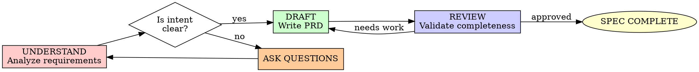

# Specification & PRD Creation

## Overview

Transform vague requirements into executable specifications. A good spec is the contract between intent and implementation.

**Core principle:** If you can't write it clearly, you don't understand it yet.

**Violating the letter of the rules is violating the spirit of the rules.**

## AI-DLC Phase: INCEPTION

This skill is part of the **Inception Phase** in AI-DLC (AI-Driven Development Lifecycle).

**Inception Goal:** Transform business intent into detailed requirements through collaborative elaboration.

**Inception Flow:**
```
Business Intent → Mob Elaboration → Specification → Context Saved
```

**Next Phase:** Construction (planning and implementation)

## When to Use

**Always:**
- New projects or features
- Significant refactors
- API changes
- Integration requirements
- User-facing functionality

**Never skip:**
- Thinking "we'll figure it out as we code"
- "It's just a small change"
- "The Jira ticket is the spec"

A Jira ticket describes WHAT. A spec describes HOW it should behave.

## The Iron Law

```
NO IMPLEMENTATION WITHOUT A SPEC FIRST
```

Start coding from a one-line requirement? Stop. Write the spec first.

**No exceptions:**
- Don't start with "exploratory" code
- Don't prototype without constraints
- Don't assume shared understanding

## The Specification Cycle



## Phase 1: UNDERSTAND - Deep Analysis

### Clarify Intent

Before writing a word, understand:

1. **Who** is the user?
2. **What** problem are they solving?
3. **Why** does this matter?
4. **When** is it needed?
5. **How** will success be measured?

### Ask Questions

**Never assume. Always clarify.**

<Good Questions>
- "What should happen if the API returns a 503?"
- "How many concurrent users should this support?"
- "What's the expected latency for this operation?"
- "What data format should the export use?"
- "Should we keep history or just current state?"
</Good Questions>

<Bad Assumptions>
- "They probably want REST"
- "I'll assume 100 users is enough"
- "Error handling can be added later"
- "They didn't specify, so it's flexible"
</Bad Assumptions>

**If it's not specified, ask. If you can't ask, document the assumption.**

## Phase 2: DRAFT - Write the PRD

### PRD Structure

```markdown
# Feature Name

## Overview
One-paragraph summary of what this does and why.

## Goals
- Measurable objective 1
- Measurable objective 2

## Non-Goals
- Out of scope 1
- Out of scope 2

## User Stories
As a [user], I want [feature] so that [benefit].

## Functional Requirements

### Requirement 1: [Name]
**Given** [context]
**When** [action]
**Then** [expected result]

### Requirement 2: [Name]
...

## API/Interface Specification
```
Endpoint: POST /api/v1/resource
Request: { "field": "value" }
Response: { "id": "uuid", "status": "created" }
Errors: 400 (bad request), 409 (conflict)
```

## Technical Constraints
- Must support X concurrent users
- Must complete in < Y ms
- Must work with Z dependency

## Open Questions
1. [Question to resolve]
2. [Another question]

## Acceptance Criteria
- [ ] Criterion 1
- [ ] Criterion 2
```

### Writing Good Requirements

<Good>
```
**Given** a user with unverified email
**When** they attempt to access premium features
**Then** they see a modal prompting email verification
**And** the feature remains inaccessible until verified
```
Specific, testable, unambiguous
</Good>

<Bad>
```
Users should verify their email before accessing premium features
```
Vague, untestable, missing edge cases
</Bad>

### Requirements Checklist

Every requirement must be:
- [ ] **Specific**: No vague terms ("fast", "user-friendly")
- [ ] **Measurable**: Can be tested/verified
- [ ] **Achievable**: Technically feasible
- [ ] **Relevant**: Directly supports goals
- [ ] **Traceable**: Can link to user story

## Phase 3: REVIEW - Validate Completeness

### Self-Review Checklist

Before calling a spec complete:

- [ ] All user stories have acceptance criteria
- [ ] Edge cases documented (errors, empty states, limits)
- [ ] API contracts fully specified (request/response/errors)
- [ ] Performance requirements quantified
- [ ] Security considerations addressed
- [ ] Dependencies identified
- [ ] Rollback plan considered

### Red Flags - Stop and Fix

- Vague adjectives ("fast", "easy", "good")
- Missing error scenarios
- Unspecified data formats
- No performance constraints
- Undefined user states
- Assumed implementation details

## Specification Anti-Patterns

| Anti-Pattern | Why It Fails | Fix |
|--------------|--------------|-----|
| "The dev will figure it out" | Spec becomes code reviews | Document decisions |
| "We'll iterate on it" | No foundation to iterate from | Draft → Review → Iterate |
| "It's obvious" | Different interpretations | Write it anyway |
| "Too detailed, constrains creativity" | Creative solutions to wrong problem | Constraints enable creativity |
| "Just copy what X does" | Different contexts, different needs | Analyze, don't copy |

## Common Rationalizations

| Excuse | Reality |
|--------|---------|
| "Specs slow us down" | Rework from bad specs slows you more |
| "Agile means no specs" | Agile means responding to change, not chaos |
| "The code IS the spec" | Code shows what IS, not what SHOULD BE |
| "We'll discover requirements as we build" | You discover them anyway, but with code debt |
| "Small changes don't need specs" | Small changes compound into big messes |

## Examples

### Example: API Endpoint

<Weak Spec>
```
Create an endpoint to get user data.
```
</Weak Spec>

<Strong Spec>
```
## API: Get User Profile

**Endpoint:** `GET /api/v1/users/{userId}/profile`

**Authentication:** Required (Bearer token)

**Path Parameters:**
- `userId` (UUID): The user's unique identifier

**Query Parameters:**
- `include` (optional, string[]): Related data to include. Options: `orders`, `preferences`, `activity`

**Success Response (200):**
```json
{
  "id": "uuid",
  "email": "user@example.com",
  "name": "Jane Doe",
  "createdAt": "2024-01-15T10:30:00Z",
  "preferences": { ... }, // if requested
  "orders": [ ... ] // if requested
}
```

**Error Responses:**
- `401 Unauthorized`: Invalid or missing token
- `403 Forbidden`: Requesting other user's profile without permission
- `404 Not Found`: User does not exist

**Performance:**
- Must respond in < 200ms at p95
- Rate limit: 100 req/min per user

**Caching:**
- Cache for 5 minutes unless include=activity
```
</Strong Spec>

## Integration with Implementation

The spec becomes the contract:
1. AI uses spec to plan implementation
2. Tests verify against spec requirements
3. Code review checks spec compliance
4. Documentation derived from spec

## Final Rule

```
Specification → Test Plan → Implementation → Verification

Skip the spec? You can't verify you built the right thing.
```

No exceptions without your human partner's permission.
