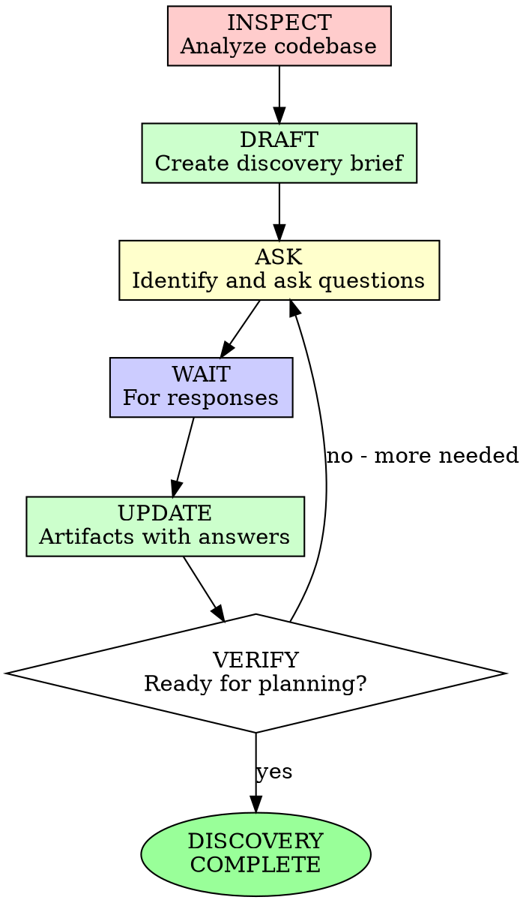

# Understanding / Discovery Phase

## Overview

Transform high-level asks into evidence-backed discovery packets ready for planning. This skill ensures discovery is thorough, documented, and resumable across sessions.

**Core principle:** Discovery without artifacts is lost work.

## When to Use

**Always for:**
- New features requiring substantial work
- Overhauls of existing systems
- Integration requirements
- Complex requirements with ambiguous scope

**Never skip when:**
- The ask is vague or high-level
- Multiple systems may interact
- Implicit requirements likely exist
- Success criteria are undefined

## AI-DLC Phase: INCEPTION

This skill is part of the **Inception Phase** in AI-DLC (AI-Driven Development Lifecycle).

**Understanding Phase Goal:** Transform business intent into comprehensive, testable understanding through codebase inspection and stakeholder collaboration.

**Flow:**
```
High-Level Ask → Codebase Inspection → Question/Answer Loop → Discovery Artifacts → Ready for Planning
```

## The Iron Law

```
NO PLANNING WITHOUT COMPLETED DISCOVERY ARTIFACTS
```

Discovery incomplete? Stop. Finish the artifacts first.

**No exceptions:**
- Don't start "exploratory" implementation
- Don't skip question logging
- Don't assume understanding without evidence

## The Discovery Cycle



## Phase 1: INSPECT - Codebase Analysis

### Systematic Exploration

Use the following tools to explore the codebase:

1. **Glob** - Find files by pattern
2. **Grep** - Search for specific patterns
3. **Read** - Examine file contents
4. **Task/Subagents** - Delegate complex exploration

### What to Look For

For each relevant area, document:

| Area | What to Find | Evidence Needed |
|------|--------------|-----------------|
| Similar Features | Existing implementations | File paths, module names |
| UI Patterns | Screens, routes, components | File paths, navigation flows |
| APIs | Endpoints, contracts | Request/response schemas |
| Data Models | Entities, relationships | Schema definitions, migrations |
| Background Jobs | Workers, queues, events | Job definitions, handlers |
| Auth/Permissions | Access control | Middleware, guards, policies |
| Tests | Existing test patterns | Test files, fixtures |
| Telemetry | Metrics, logging, tracing | Instrumentation code |
| Documentation | READMEs, ADRs, specs | File paths, key decisions |

### Codebase Analysis Checklist

- [ ] Identified 3+ similar features or reference implementations
- [ ] Documented existing patterns (architecture, data access, error handling)
- [ ] Found relevant UI flows and navigation patterns
- [ ] Located API contracts and service boundaries
- [ ] Mapped data models and persistence patterns
- [ ] Identified auth/permission boundaries
- [ ] Found existing tests for similar functionality
- [ ] Documented failure handling patterns
- [ ] Located relevant telemetry/metrics

## Phase 2: DRAFT - Create Discovery Brief

### Discovery Brief Structure

Create `discovery-brief.md` in the unit's discovery folder:

```markdown
# Discovery Brief: [Feature Name]

## Metadata
- **Unit ID:** unit-xxx
- **Ticket/Issue:** [reference]
- **Discovery Started:** [date]
- **Discovery Completed:** [date] or In Progress
- **Status:** [Draft / Awaiting Answers / Ready for Planning]
- **Lead:** AI Agent

## Problem Summary
[One paragraph describing the business problem being solved]

## Goals
[Measurable objectives]

## Non-Goals
[Explicitly out of scope]

## Actors and Personas
- [Actor 1]: [Role, needs, context]
- [Actor 2]: [Role, needs, context]

## Assumptions
| Assumption | Source | Confidence |
|------------|--------|------------|
| [Assumption 1] | Inferred | Medium |
| [Assumption 2] | Stated | High |

## Unknowns
[What we still need to learn]

## Similar Existing Features

### Feature 1: [Name]
- **Location:** [file paths]
- **Pattern:** [architecture pattern used]
- **Reusable:** [Yes/No/Partial]
- **Differences:** [How this ask differs]
- **Interaction Risk:** [Low/Medium/High]

### Feature 2: [Name]
...

## Architectural Patterns Observed
- [Pattern 1]: [Where found, when to use]
- [Pattern 2]: [Where found, when to use]

## Interaction Map

### UI Interactions
- [Screen/Flow 1] → [affects] → [New Feature]
- [New Feature] → [navigates to] → [Screen/Flow 2]

### API Interactions
- [Service 1] → [calls] → [New API]
- [New API] → [depends on] → [Service 2]

### Data Interactions
- [Entity 1] → [relates to] → [New Entity]
- [New Entity] → [stored in] → [Database/Cache]

## Data Boundaries
- **Input:** [What data comes in]
- **Output:** [What data goes out]
- **State:** [What persists]
- **Validation:** [What rules apply]

## Permissions and Security Notes
- **Access Control:** [Who can do what]
- **Sensitive Data:** [What needs protection]
- **Compliance:** [Relevant requirements]

## Failure Modes
| Scenario | Likely Cause | Current Pattern | Recommendation |
|----------|--------------|-----------------|----------------|
| [Failure 1] | [Cause] | [How handled elsewhere] | [Approach] |

## Usage Expectations
- **Expected Users:** [Who will use this]
- **Volume:** [Transactions/users per time period]
- **Growth:** [Expected trajectory]

## SLA / SLO / Metrics
- **Availability:** [Target uptime]
- **Latency:** [Target response times]
- **Error Rate:** [Acceptable threshold]
- **Key Metrics:** [What to measure]

## Risks and Dependencies
| Risk | Likelihood | Impact | Mitigation |
|------|------------|--------|------------|
| [Risk 1] | [Low/Med/High] | [Low/Med/High] | [Approach] |

## Open Questions
[Links to question-log.md]

## Readiness Assessment

### Blockers
- [ ] [List any blockers]

### Completed
- [x] [List what's ready]

### Recommendation
**Status:** [NOT READY / READY WITH CAVEATS / READY]

**Rationale:** [Why]

**Next Step:** [What happens next]
```

## Phase 3: ASK - Identify and Ask Questions

### Question Identification

From the discovery brief, derive questions in these categories:

1. **Product/Business**
   - Who are the users?
   - What problem are we solving?
   - What does success look like?
   - What are the constraints?

2. **UX/Design**
   - What should the user experience be?
   - Are there design mockups?
   - What platforms/devices?

3. **Data/Model**
   - What data is needed?
   - How is it structured?
   - What are the relationships?

4. **Technical**
   - What patterns should we follow?
   - Are there performance requirements?
   - What integrations are needed?

5. **Security/Compliance**
   - Who can access what?
   - Are there compliance requirements?
   - What data needs protection?

6. **Operations**
   - What are the SLA requirements?
   - How do we monitor this?
   - What's the rollback strategy?

7. **Migration/Rollout**
   - Do we need to migrate data?
   - How do we roll this out?
   - What about backward compatibility?

### Question Priority Matrix

| Priority | Definition | Action |
|----------|------------|--------|
| **Blocking** | Cannot proceed without answer | Ask immediately, wait for response |
| **Important** | Significantly impacts design | Ask soon, can proceed with assumptions |
| **Nice-to-know** | Helpful context | Ask when convenient |

### Asking Questions

**Use the harness's built-in tooling:**

1. **Question Tool** - For structured, async questions
2. **Mob Sessions** - For collaborative elaboration
3. **Plugins** - For external channels (Discord, Slack, etc.)

**Question Asking Rules:**

- Ask blocking questions first
- Batch related questions together
- Provide context for each question
- Explain why the answer matters
- Suggest options when appropriate
- Wait for responses before proceeding on blocked work

## Phase 4: LOG - Document Questions and Responses

### Question Log Structure

Create `question-log.md` in the unit's discovery folder:

```markdown
# Question Log

## Metadata
- **Unit ID:** unit-xxx
- **Topic:** [Feature/Ask]
- **Status:** [In Progress / Complete]
- **Last Updated:** [timestamp]

## Summary
- **Total Questions:** [N]
- **Answered:** [N]
- **Pending:** [N]
- **Blocking:** [N]

## Questions

### Q-001
- **ID:** Q-001
- **Status:** answered
- **Priority:** blocking
- **Category:** Product/Business
- **Asked Via:** [harness question tool / mob session / discord / etc.]
- **Asked At:** [ISO timestamp]
- **Asked By:** AI Agent
- **Question:** [Full question text]
- **Context:** [Background information]
- **Why This Matters:** [Impact of answer on discovery]
- **Options Considered:**
  - Option A: [description]
  - Option B: [description]
- **Response:** [Full answer]
- **Answered By:** [Person/role]
- **Answered At:** [ISO timestamp]
- **Implications:**
  - [How this affects the discovery brief]
  - [Technical decisions influenced]
- **Artifacts Updated:** [Which files were modified based on this answer]

### Q-002
- **ID:** Q-002
- **Status:** open
- **Priority:** important
- **Category:** Technical
- **Asked Via:** discord plugin
- **Asked At:** [ISO timestamp]
- **Asked By:** AI Agent
- **Question:** [Full question text]
- **Context:** [Background information]
- **Why This Matters:** [Impact on architecture decisions]
- **Response:** Pending
- **Blocker For:** [What work is blocked until answered]
```

### Question Logging Rules

1. **Every question gets an ID** (Q-001, Q-002, etc.)
2. **Every question gets logged** regardless of how it was asked
3. **Every response gets appended** to the question entry
4. **Implications must be documented** for how the answer affects the discovery
5. **Artifacts must reference** which questions influenced them
6. **Pending questions remain visible** until answered or explicitly deprioritized

## Phase 5: UPDATE - Revise Artifacts with Answers

### After Each Response

1. Update the question log with the answer
2. Update the discovery brief with implications
3. Update assumptions (confirm, revise, or remove)
4. Update unknowns (remove answered, add new ones)
5. Update readiness assessment

### Versioning

Discovery artifacts should be updated incrementally. Use:
- `Last Updated` timestamps
- `Artifacts Updated` references in question log
- Brief change notes for major revisions

## Phase 6: CREATE - User Stories and Test Scenarios

### User Stories

Create `user-stories.md`:

```markdown
# User Stories

## US-001: [Title]
**As a** [persona]
**I want** [capability]
**So that** [benefit]

### Acceptance Criteria
- **Given** [context]
- **When** [action]
- **Then** [expected result]

### Notes
- [Additional context]
- [Edge cases]
- [Dependencies]

### Related Questions
- Q-001: [How this informed the story]
```

### Test Scenario Matrix

Create `test-scenarios.md`:

```markdown
# Test Scenario Matrix

## Summary
- **Total Scenarios:** [N]
- **Happy Path:** [N]
- **Edge Cases:** [N]
- **Failure Modes:** [N]

## Scenarios

| ID | Scenario | Type | Priority | User Story | Notes |
|----|----------|------|----------|------------|-------|
| TS-001 | [Description] | happy path | high | US-001 | [Details] |
| TS-002 | [Description] | validation | high | US-001 | [Details] |
| TS-003 | [Description] | failure mode | medium | US-001 | [Details] |

## Coverage by Category

### Functional
- [ ] Primary success path
- [ ] Alternate flows
- [ ] Validation errors
- [ ] Business rule violations

### Non-Functional
- [ ] Performance under load
- [ ] Concurrent access
- [ ] Error recovery
- [ ] Security boundaries

### Integration
- [ ] API contract compliance
- [ ] Data persistence
- [ ] Event handling
- [ ] External service failures
```

## Phase 7: VERIFY - Readiness Assessment

### Readiness Checklist

Before marking discovery complete:

- [ ] Discovery brief created and current
- [ ] All asked questions logged
- [ ] All received responses documented with implications
- [ ] Open questions clearly marked (blocking vs. non-blocking)
- [ ] Similar features analyzed with evidence
- [ ] Interactions mapped across systems
- [ ] User stories created with acceptance criteria
- [ ] Test scenarios comprehensive
- [ ] Assumptions explicitly stated
- [ ] Risks identified with mitigations
- [ ] Success criteria measurable
- [ ] Readiness assessment completed

### Readiness Decision

**NOT READY:**
- Blocking questions unanswered
- Critical assumptions unverified
- Major technical risks unassessed

**READY WITH CAVEATS:**
- Minor questions pending
- Non-blocking assumptions remain
- Risks identified with mitigation plans

**READY:**
- All blocking questions answered
- Sufficient understanding to plan
- Risks acceptable and mitigated

## Artifact Storage

### Recommended Structure

```
.ai-dlc/
  units/
    unit-xxx/
      discovery/
        discovery-brief.md
        question-log.md
        user-stories.md
        test-scenarios.md
        decisions.md
        state.md
      spec.md
      plan.md
```

### State File

Create `state.md` to track progress:

```markdown
# Discovery State

## Current Status
[In Progress / Awaiting Answers / Ready for Planning]

## Progress
- [x] Codebase inspection complete
- [x] Discovery brief drafted
- [x] Questions identified and asked
- [ ] All blocking questions answered
- [ ] User stories created
- [ ] Test scenarios documented
- [ ] Readiness assessed

## Active Work
[What's currently happening]

## Blockers
[What's preventing progress]

## Next Actions
[What needs to happen next]

## Session History
- [timestamp]: [What was done]
- [timestamp]: [What was done]
```

## Tool Usage Rules

### Required Tools

1. **Glob** - Find files by pattern
2. **Grep** - Search for code patterns
3. **Read** - Examine file contents
4. **Write** - Create artifact files
5. **Edit** - Update artifact files
6. **Question** - Ask clarifying questions

### Tool Selection Guidelines

- **Use exploration tools first** - Always inspect before assuming
- **Use question tool for blocking items** - Don't guess on critical decisions
- **Write artifacts incrementally** - Update as understanding improves
- **Prefer structured output** - Markdown with clear sections

### When to Use Subagents

Delegate to subagents when:
- Exploring multiple areas in parallel
- Analyzing complex systems
- Searching for patterns across large codebases
- Gathering evidence for discovery brief

## Integration with Other Skills

### With `specify`

- Use `specify` for structuring requirements
- Use `understanding-discovery` for codebase analysis
- Discovery informs the spec, spec guides implementation

### With `mob-collaboration`

- Use `mob-collaboration` for stakeholder sessions
- Document mob outcomes in question log
- Record mob decisions in decisions.md

### With `context-persistence`

- Use `context-persistence` for session continuity
- Store discovery artifacts in unit folder
- Reference context from previous sessions

## Anti-Patterns

| Anti-Pattern | Problem | Solution |
|--------------|---------|----------|
| "I'll remember the answers" | Lost context | Log everything |
| "The chat history is enough" | Not searchable | Create structured artifacts |
| "One big discovery brief" | Hard to update | Separate artifacts by concern |
| "Questions without context" | Hard to answer | Explain why each question matters |
| "Discovery in my head" | Not collaborative | Write it down |
| "Skipping similar feature analysis" | Reinvents patterns | Always inspect existing code |
| "Not asking blocking questions" | Wrong assumptions | Ask early, ask often |

## Examples

### Example: Question Log Entry

```markdown
### Q-003
- **ID:** Q-003
- **Status:** answered
- **Priority:** blocking
- **Category:** Operations
- **Asked Via:** harness question tool
- **Asked At:** 2026-04-04T14:30:00Z
- **Asked By:** AI Agent
- **Question:** What is the acceptable latency for notification delivery? Should we optimize for average case or p99?
- **Context:** The notification system needs to handle burst traffic during peak hours. We're deciding between simple polling vs. event-driven architecture.
- **Why This Matters:** This determines whether we need a queue-based system, affects infrastructure costs, and influences the retry strategy.
- **Options Considered:**
  - A: < 1 second average (simple polling, lower cost)
  - B: < 5 seconds p99 (queue-based, higher reliability)
  - C: < 30 seconds acceptable (batch processing, lowest cost)
- **Response:** We need < 5 seconds p99. Users expect near-real-time notifications, and delays beyond that hurt engagement metrics.
- **Answered By:** Product Manager (Sarah)
- **Answered At:** 2026-04-04T15:15:00Z
- **Implications:**
  - Must use queue-based architecture (SQS/SNS or similar)
  - Need to implement retry with exponential backoff
  - Should add latency metrics to monitoring
  - Infrastructure cost will be higher than polling approach
  - Affects discovery-brief.md: Architecture section
  - Affects test-scenarios.md: TS-007 (latency under load)
- **Artifacts Updated:**
  - discovery-brief.md: Updated SLA section
  - discovery-brief.md: Updated architectural patterns
  - test-scenarios.md: Added TS-007
```

### Example: Discovery Brief Section

```markdown
## Similar Existing Features

### Feature: Email Notifications
- **Location:** 
  - `src/services/notifications/email.ts`
  - `src/workers/email-sender.ts`
  - `src/api/routes/notifications.ts`
- **Pattern:** Queue-based with BullMQ, retry 3x with exponential backoff
- **Reusable:** Partial - queue infrastructure reusable, email-specific logic not
- **Differences:**
  - Current: Only email channel, simple preferences
  - New Ask: Multi-channel (push, SMS), complex preference hierarchy
- **Interaction Risk:** Medium
  - Will share queue infrastructure
  - Preference storage schema needs extension
  - UI settings page needs modification

### Feature: User Preferences
- **Location:**
  - `src/models/preferences.ts`
  - `src/api/routes/preferences.ts`
- **Pattern:** Simple key-value storage in PostgreSQL
- **Reusable:** Yes - pattern can extend to notification preferences
- **Differences:**
  - Current: Flat structure, global per user
  - New Ask: Hierarchical (channel × event type), inheritance rules
- **Interaction Risk:** Low
  - Existing patterns adequate
  - Schema migration straightforward
```

## Final Rules

1. **Always generate artifacts** - Discovery without documentation is wasted
2. **Log every question** - Full traceability of decisions
3. **Cite evidence** - Every technical claim needs a file path or reference
4. **Wait for answers** - Don't proceed on blocked work
5. **Assess readiness explicitly** - Clear go/no-go decision
6. **Separate concerns** - Different files for different purposes

```
Discovery → Artifacts → Planning → Implementation
     ↑_________|_________↑
   (feedback loop via question log)
```

No exceptions without your human partner's permission.
